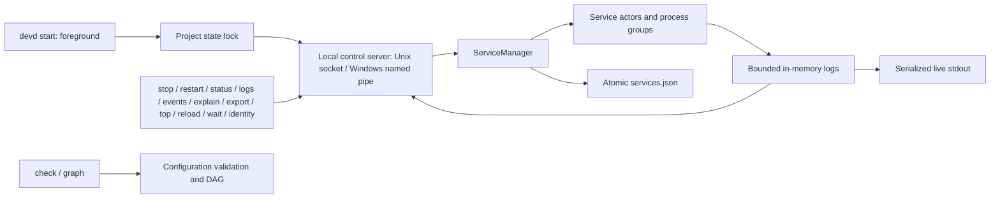
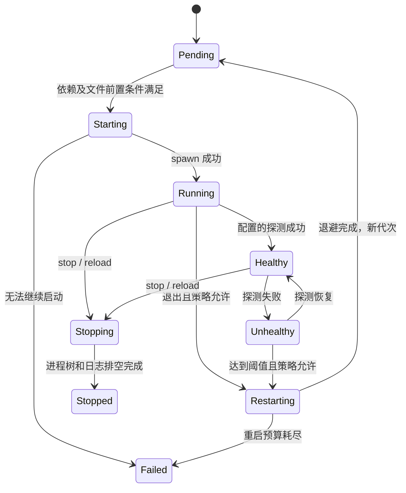

# devd - 架构设计文档

## 当前控制链路

v0.7 M7 的 `cli::agent` 提供 schema 1 JSON-lines stdio adapter。启动时读取活 Identity，并核对所选 config/profile/规范化 state 与实例摘要，固定整个会话的 instance/run。授权仅从启动参数 `--allow` 获取，默认空；四类控制在任何 I/O 前验证 grant 与请求 target。在线操作包装成 `Request::Scoped`，supervisor 在分派前验证 instance/run，拒绝嵌套 scope；原有 CLI 请求保留兼容。adapter 不另建控制器，继续调用现有 restart/stop/reload/wait/诊断用例。离线 clean 复用 CLI 的 typed execute，core 在状态锁内、完成回执前再次比较 expected_run。status/restart 复用导出状态白名单，wait 复用严格就绪解码器，export 直接返回结构不写文件。stdin 使用独立线程与有界 channel，避免不可取消的标准输入占据 Tokio blocking pool；串行分派、16 KiB 行／4096 字节内部请求／8 MiB 回复／5 秒输出超时。EOF 排空输入，信号只取消 adapter；已受理控制不回滚。机器回复的 ok 表示报告可用，具体成功由 outcome 决定，id 不保证控制去重。describe 身份标注为会话建立时观测，不冒充持续在线状态。该授权约束 adapter，不构成同用户进程沙箱、多用户 RBAC 或 MCP 服务。

v0.7 M6 的 `core::owned_paths` 管理显式 `cleanup: true` 的 instance 目录。manager 持有 StateStore 锁后创建全新目录、写随机 marker 并原子登记到 `owned-paths.json`，不接管已有未登记目录；运行开始前置非静止，只有 manager 成功完成才登记正常结束。阻塞任务持有锁 lease，取消不会让未完成的写入越过锁生命周期。`cli::clean` 在阻塞任务中只读解析当前 YAML，按配置目录解析有效服务 cwd，再取得已有状态锁，核对配置/state/profile、文件身份、当前授权与正常结束记录。以 cap-std 目录句柄做有界目录清单，拒绝链接、硬链接、特殊文件、嵌套状态标记和跨文件系统条目；计划摘要包含原始配置字节摘要、run、journal revision、锁身份与目录清单。所有根预检后再逐根写 deleting 检查点、删除、退休记录，最后保存完成回执。Windows 通过从开始就带 DELETE 权限且不共享删除的目录句柄与 FileDispositionInfo 删除；Unix 使用目录句柄相对删除。部分失败需重新预览，已完成计划重复应用不触碰后来出现的数据。共享别名重叠拒绝，日志／事件／快照和未授权路径保留；历史 PID 不参与判断。树清单是元数据观测，不是内容快照或外部并发写入事务。cleanup 声明变化在 reload 预览与 apply 同时拒绝，须完整 stop/start。

v0.7 M5 的 `cli::top` 先读取活实例身份，再核对状态的运行标识；独立读取任务以 cursor 每秒增量查询内存事件，保留最多 1000 行事件／缺口，并与日志页分开呈现。时间线严格检查运行和序号，展示事件代次与已记录 cause 引用，引用被淘汰时标为 unavailable，不根据时序生成因果结论。历史缺口计数、最新缺口、本地淘汰及持久化状态持续展示。状态、事件和日志分别采集，不构成原子快照。日志订阅和重启／停止请求携带可选 expected_run_id，服务端在订阅或副作用前检查；旧协议客户端可省略，TUI 必须携带，防止端点换代后误操作新运行。这是实例运行核对，不是用户权限模型。所有读取在独立任务中完成帧解码，退出通过 RAII 恢复终端并取消客户端任务，已接受的控制保持正常生命周期。

v0.7 M4 的服务级 `ports` 与 `paths` 分别保存命名 TCP 地址和带 shared/instance 归属的路径。配置校验拒绝端口冲突、独占路径重叠及可见环境名冲突；profile 对映射整体替换。`prepare_config` 从自身与直接依赖生成有效环境并缓存，服务 actor 和脚本探测共用该结果；原始配置仍作为 reload 基线，不混入派生环境。实例路径按所选状态目录的 `runtime/` 解析，共享路径按声明服务 cwd 解析，解析为绝对 UTF-8 路径；默认不会创建或删除目录，M6 的显式 cleanup 例外见上文。reload 提交时同步替换探测与有效环境，沿用原有下游影响与停启顺序。doctor 将映射端口与 listen 去重后试绑，检查不预约端口；实际应用绑定失败由原有日志、退出及健康证据呈现，不推断因果。路径 scope 是声明，不是沙箱或自动清理授权。

v0.7 M3 的 `cli::export` 通过单次控制请求从活 supervisor 采集实例身份、状态快照、事件窗口和可选的内存日志。报告为状态字段白名单，省略重载失败自由文本；每个当前或近期服务的解释复用同一批事件。采样前后比较状态与事件水位，只标记观测期间是否稳定，不承诺跨来源原子快照。客户端将 JSON 先写到目标目录的临时文件，再以不覆盖方式发布，失败不会替换既有报告。

v0.7 M2 的 `cli::wait` 使用一条不重连的只读控制连接订阅 supervisor 内存快照，`core::readiness` 将所选服务的状态、PID 和代次归约成就绪报告。有探测要求 Healthy，否则要求 Running，两者均需 PID；手动重启屏障先于控制请求发布，避免旧代次误满足。manager 的独立 watch 保存停止标记、进行中的手动重启和单调递增的 reload epoch；已接受重载即增加 epoch，即使无变化或完成过快也不会被 watch 合并漏掉。拒绝的重载不触发屏障。配置读取、观测与重载提交保持 snapshot → configuration/control 的锁顺序，运行状态磁盘 schema 不变。每个实例最多 8 个等待，与最多 16 个日志/事件跟随者一起为 32 个总连接保留控制余量。客户端整体 deadline 包含连接，服务端也限制期限；断连及时释放名额，取消不持有 controller，不产生生命周期事件或磁盘写入。JSON schema 1 保留最后观测及其时间，不承诺返回时仍健康。最终 stdout 写入和 flush 复用平台异步输出，另有 5 秒期限，期间继续响应取消；输出失败可留下不完整 JSON，但不会停止服务。

实例登记的阻塞写入持有状态锁直至原子替换结束；取消启动不会提前释放所有权，避免迟到的旧写入覆盖新运行记录。已有记录（含悬空链接）必须通过普通文件安全检查，才允许替换。

v0.7 M1 的 `cli::instances` 在持有 supervisor 状态锁、尚未启动服务时，将身份原子登记到项目/worktree 根目录 `.devd/instances/<instance_id>.json`。身份摘要来自配置绝对路径、规范化状态目录和 profile；run_id 复用事件运行标识，分支/提交仅为启动观测。`identity` 返回活 supervisor 持有的身份，不读取索引或 YAML。`instances` 使用有界只读 Git 命令找到当前仓库 worktree，读取有大小限制、拒绝链接/特殊文件的登记记录；最多 8 个并发、每端点 750 ms 核对完整身份。旧记录不会用来接管 PID，也不会自动删除。损坏或无法读取的索引进入 warnings/complete=false；不可达只代表端点观测失败。该模块不更改运行状态快照格式、端口或应用数据归属。

v0.4 的平台差异集中在 `platform/`、`cli/transport.rs` 与 stdout 实现中。Unix 保留进程组与 socket；Windows 在 CREATE_SUSPENDED 状态下创建服务、绑定带 KILL_ON_JOB_CLOSE 的独立 Job，再通过 ToolHelp 定位并恢复主线程，避免加入 Job 前逃逸。停止先发送定向 Ctrl+Break，超时后终止 Job；无控制台时直接终止。正常退出等待 Job 活动进程数归零，取消/Drop/父进程强杀通过 Job 句柄关闭清理。Script 与服务共用同一所有权机制。

Windows 控制端点用规范化实例路径的稳定摘要命名，管道拒绝远程客户端，显式 DACL 仅允许当前用户；first-instance 防抢占，接受连接前建立下一实例以持续持有名称。长度上限、I/O 超时和客户端额度由共同协议层保持。profile 目录在 Windows 将所有名称字节编码为十六进制并加前缀，避免设备保留名、大小写和尾点别名；Unix 保持既有路径。

状态和日志使用标准库文件锁（Unix flock、Windows LockFileEx），状态 JSON 同目录替换。安全文件打开层拒绝链接、重解析点、非普通文件与受管日志硬链接；Unix 保留 O_NOFOLLOW/O_NONBLOCK 和 0700/0600，Windows 磁盘文件继承目录 ACL。Windows stdout 用独立有界线程和取消同步 I/O，避免阻塞 Tokio 关闭；控制台通过 UTF-16 输出，重定向保留 UTF-8。Windows `check`/`start` 在执行前拒绝 Unix socket 探测，其余生命周期、资源、健康和日志逻辑跨平台共享。

`cli/mod.rs` 负责 clap 参数、配置路径和命令输出；`cli/graph.rs` 将已校验的依赖图确定性地渲染为文本、DOT 或 Mermaid，图边从前置服务指向依赖者并标注就绪条件；`cli/protocol.rs` 提供有界长度前缀 JSON；`cli/server.rs` 在同一状态锁下管理 socket、编排器与客户端；`cli/snapshot.rs` 负责离线配置副本；`cli/stdout.rs` 支持可取消的终端/管道写入；`cli/top.rs` 用独立状态轮询、日志订阅和控制请求驱动 TUI。运行控制命令通过活实例操作，离线 status 报错，不信任旧状态文件中的 PID。

默认状态目录为 `<config-dir>/.devd/<config-name>/`，可用 `--state-dir` 覆盖。服务 cwd 相对配置目录；环境文件相对服务 cwd。stop 的响应表示请求已接受，前台 supervisor 负责完成反向依赖关闭。手动 restart 通过 manager channel 停止旧 actor 并重建，保留计数/日志代次、重新检查依赖；仅当下游显式开启 `restart-on-dep-recovery` 时，目标恢复会触发后续联动。命令成功只表示指定目标的新进程已启动。

v0.3 增加单文件 `profiles` 与全局 `--profile`。`config/profile.rs` 独占文档解析、别名归一化及覆盖合并；运行时 `DevdConfig` 只包含所选结果。所有定义检查 schema，选中结果再执行依赖和就绪校验。`env`、`restart` 按字段合并，其余字段整体替换；可选字段支持 null 清除。CLI 在默认或显式运行目录下追加 `profiles/<name>/`，大写字节转义为 `~hh`，保证大小写不敏感文件系统上的不同 profile 也有不同端点。控制命令只校验名称和计算路径，不读取 YAML；服务目录、端口与应用文件不在隔离范围内。

配置快照按完整 YAML 文件保存于基础状态目录的 `snapshots/<name>.yml`，不进入 profile 子目录。保存和恢复复制原始字节，支持未完成编辑的配置；校验仍由 `check` 负责。临时文件先写入同一目录并同步，再通过不覆盖的原子发布创建目标；快照名限制为安全的小写 ASCII，恢复目标只能是原配置目录的新文件名，以维持相对路径语义。配置快照不接触 `services.json`、控制 socket 或进程；恢复不会修改运行中实例，也不会接管遗留 PID。

当前可用命令为 start、stop、restart、reload、wait、identity、instances、export、agent、clean、status、top、logs、events、explain、doctor、check、graph、init、snapshot；logs/events 支持 --follow 和 --stored，支持 TCP/HTTP/Unix Socket/Script 健康检查和 fixed/exponential 重启延时。status 提供服务主进程 CPU／RSS 采样。top 仅连接活实例，退出界面不停止服务，停止全栈必须在界面内确认；终端恢复由 RAII 处理。配置监听、自动重载和文件自动修复尚未实现。

v0.6 的 `reload --dry-run [--candidate PATH] [--json]` 通过控制端点读取 supervisor 持有的当前有效配置基线。`cli::reload` 在最多两个并发 blocking 任务内读取候选普通文件（上限 1 MiB），沿用实例 profile，按候选目录解析 cwd；`core::reload` 调用与启动共用的静态配置准备函数，校验命令、探测设置、计时器和依赖图，不执行探测或读取 dotenv 内容。任务不持有 controller、状态 writer 或事件记录器；全栈 stop 优先取消等待，即使 OS 读取稍后返回也不能改变服务。并发名额由 blocking 闭包持有直到返回，避免取消后无限积累后台读取。

预览按有效服务定义比较字段；命令参数、默认值、别名、映射/依赖顺序与资源单位归一化，路径不折叠可能穿过软链接的 `..`，保留尾部目录语义。差异传播沿旧、新反向依赖边的并集遍历，visited 集合处理并集成环；旧图逆序停止层、新图正序启动层均只保留受影响服务。报告只输出字段名和原因服务，不传输完整配置。排序 JSON 的 SHA-256 标识旧/新配置，plan 摘要还绑定 run_id、profile、PID、代次及生命周期状态，不受 CPU/RSS 采样影响。它描述一次读取与快照，不锁定后续变化。`--apply --plan ID` 重读候选并在 manager 中重算计划；不匹配即拒绝，`apply_available: true` 只表示支持在线应用。

`service_manager/reload_apply.rs` 的状态机由 manager 主循环驱动，没有独立后台编排任务。静态校验及计划核对在副作用前完成；核对快照与向受影响 actor 发送 Quiescing 共用快照读锁。手动 restart 与 reload 互斥，第二次 reload 拒绝。按旧图逆序分层停止并 join 旧 actor 后，在快照写锁下切换配置订阅与服务集合；未变化 actor 保持，新 actor 按新图分层启动。Loading 控制态暂停受影响服务的自动恢复；有探测的服务要求 Healthy，其余要求 Running，每层就绪等待沿用 dependency_timeout。全栈停止优先于下一层推进。

资源监控通过 watch 接收最新阈值，在重载期间仅评估无关服务，完成后恢复全部阈值。旧 actor join 后才删除状态，避免依赖恢复与资源采样引用消失的服务。候选只更新内存，启动路径/profile、状态目录与日志选项不变。成功响应前落盘当前快照；失败/中断沿用全栈清理，不做回滚。报告与 ReloadStarted/ReloadServiceSelected/ReloadFinished 事件给出计划标识、配置是否切换和实际进度，受既有事件容量/截断约束。客户端断开或响应超时不取消已受理的动作。

资源采集由 `core::resource_monitor` 每秒通过阻塞线程池读取受管主 PID 的 sysinfo 指标，生命周期仍由 service actor 独占。监控 future 随 manager 驱动、退出时停止轮询；在途 OS 读取只持有局部数据，不能在退出后写回状态。采样以 PID、started_at、restart_count 核对进程代次，actor 发布健康状态时保留同代指标，退出时清除。CPU 首次采样只建立基线；不可用指标保持空值。缓存随代次淘汰，Linux 线程枚举关闭；不统计子进程。可选 `limits` 对采样值执行跨阈值告警与恢复日志，不执行强制限制。

`core::events` 是 v0.5 的结构化生命周期事实源。每个 supervisor 实例创建独立 `run_id`，actor、manager 和资源监控器在决策与观测发生处写入单调序号事件；`event_generation` 标记一次服务进程尝试，`cause` 只引用同一运行中较早的事件。记录器只保留有界内存历史并提供有界 broadcast 订阅，lag 必须由消费者显式处理；它不持有进程、不驱动重试，也不在状态锁内等待磁盘。事件中的进程错误、探测失败和资源证据均为脱敏枚举，不保存命令、URL、环境文件内容或脚本错误文本。运行快照继续负责最新状态，新字段带 serde 默认值以兼容旧状态文件。

`core::events::query` 定义事件类型筛选、运行/序号游标和带 schema 版本的批次；`cli::events` 负责文本/JSON 输出及控制协议订阅。首批历史与 live receiver 在发布锁内一起取得，后续批次即使无筛选匹配也更新水位。内存保留 1024 条、单事件最多 16 KiB；订阅缓冲 256 条，落后显式报告缺口并断开。日志与事件共享 16 个长连接名额，控制命令保留独立接入空间。在线查询不重新解析 YAML。

`storage` 统一提供带锁、安全文件访问、有界记录读取、尾部修复与轮转的 JSONL 底层，日志与事件各自持有独立目录、schema 和订阅。`core::events::storage` 仅在 `start --persist-events` 时开启，在阻塞线程中追加运行上下文、事件、缺口与排空结束标记；默认单文件 10 MiB、3 份归档。启动打开失败阻止服务启动；运行写入失败只停用本次事件 writer，通过 watch 发布 `failed`，stderr 限时异步报告，不停止服务。writer 排空结束前持有状态锁租约。`events --stored` 使用共享读锁，在单记录 64 KiB、结果最多 1000 条与 128 个缺口的边界内扫描；明确报告不完整运行、保留窗口缺失和未完成尾记录，拒绝完整损坏记录及不支持的 schema。事件和应用日志的写盘失败策略分别由 server 管理。

`core::diagnostics::explain` 将同一运行的状态快照和 `EventBatch` 转为版本化报告，在线请求由控制协议返回，`--stored` 在 writer 停止后读取保留历史。在线结论以快照当前代次为准；无活服务的离线或已移除服务按保留的最新代次解释，离线 status 仍为 null。CPU 与内存分别以最新观测判定恢复；旧代故障只通过明确 cause 链作为正在重启的历史证据，不能覆盖新代 Running/Healthy。结论只由结构化事件和当前状态决定，证据包含序号、类型、代次、因果引用与时间；普通生命周期事件也会在无法判断根因时作为最近事实展示。历史缺口降低 `complete` 并进入报告。该路径不探测、不启动或重启服务，也不执行 next steps；文本与 JSON 共用同一报告模型。

`limits.on-exceed` 默认为 `warn`；仅显式 `restart` 授权超限重启，与 `restart.policy: never` 冲突。采样器按进程代次分别维护 CPU/RSS 连续超限次数；同一指标 3 次有效采样超限时，在同一快照锁内写入 `resource_restart_reason`。缺样及正常值打断该指标的连续计数，重复快照不计数。决定保持到该代次退出，避免 watch 合并更新丢失触发；actor 的同代健康更新保留它，退出或换代清除它。actor 核对代次和授权后执行既有停止、日志排空、退避、依赖等待与累计预算流程。停止及进程退出优先于资源触发，资源更新不取消在途健康探测；预算耗尽保留原因并清理全栈。持久化快照中的原因仅用于诊断，不接管旧 PID。

依赖联动由 `core::dependency_recovery` 比较依赖进程代次：actor 在通过启动就绪检查的同一个快照读锁内记录直接依赖的 PID、started_at、restart_count。运行期间只在代次变化且所有依赖满足各自条件时停止旧进程组，复用自动重启的退避、预算、依赖等待和日志排空。基线随下一次就绪检查更新，不依赖 watch 保留每次中间事件；单纯健康波动不会触发。每个服务独立恢复，非全图原子操作。监听其他服务状态时保留在途健康探测 future，防止频繁快照更新取消探测。开启联动要求存在依赖且自动策略不是 never；次数耗尽沿用 Failed 与全栈清理语义。

`core::path_requirements` 复用同一个只读 evaluator 为启动前的 `service.requires` 和 `doctor` 检查文件、目录及软链接条件。相对路径按有效服务 cwd 解析；启动时在进程依赖就绪后、spawn 前检查。失败拒绝启动并沿用全栈清理。Unix 打开文件带 O_NONBLOCK 并复查句柄类型，避免路径在 metadata 与 open 之间被替换成 FIFO 后阻塞。

v0.6 的 `core::path_monitor` 仅在服务显式设置 `monitor-requires: true` 时启用，允许 `restart.policy: never`。每次阻塞线程池检查完成后等待一秒，每条条件连续两次相同变化才发布 `path-condition-changed` 及 WARN/INFO 日志，重复失效、恢复和原子替换中仍成立的条件均不刷屏。监测 future 由 actor 在一整个进程代次内驱动，跨健康检查及快照更新保持；停止、退出、换代时直接取消。在途 OS 调用只持有路径与 cwd，没有记录器或日志句柄，返回后无法给旧代次补发事件。监测不改变状态、健康、重启预算，也不执行文件修复。

路径事件保存 requires 索引、类型、解析路径与稳定失败分类（null 表示恢复），不保存文件内容或解析后的链接目标，沿用现有事件容量和截断规则。`explain` 按运行实例与进程代次引用每条条件的最近观测，恢复时附上保留的最近失效，并明确观测不等于应用故障因果；历史缺口照常显示。磁盘留存仍由独立的 `--persist-events` 授权。

## 模块与事实源

目录以当前源码为准；此处列职责，不复制会随实现变动的 Rust struct。

| 目录或模块 | 职责 |
| --- | --- |
| `src/main.rs`、`src/cli/mod.rs` | 多线程 Tokio 入口、参数解析、配置/profile/state 选择 |
| `src/cli/server.rs`、`protocol.rs`、`transport.rs` | 活 supervisor、长度受限 JSON、Unix socket / Windows named pipe |
| `src/cli/agent.rs`、`instances.rs`、`wait.rs`、`export.rs` | 有授权边界的 stdio 接口、实例发现、就绪等待、诊断导出 |
| `src/cli/top.rs`、`top/` | 状态、日志与事件时间线；终端恢复和绑定 run 的控制 |
| `src/config/` | YAML schema、严格校验、profile 合并与时长/资源解析 |
| `src/core/service_manager.rs`、`service_manager/reload_apply.rs` | 编排、控制屏障、配置切换与反向关闭 |
| `src/core/service_task.rs`、`process_manager.rs` | 单个服务代次、进程所有权、停止、重试与流排空 |
| `src/core/dependency.rs`、`dependency_recovery.rs` | DAG、依赖就绪与显式恢复联动 |
| `src/core/health_check.rs`、`resource_monitor.rs` | 探测、CPU/RSS 采样与显式授权的超限恢复 |
| `src/core/path_requirements.rs`、`path_monitor.rs`、`owned_paths.rs` | 文件前置条件、只读监测与有授权的实例目录清理 |
| `src/core/events/`、`events.rs`、`diagnostics.rs` | 有界事实、查询/持久化与确定性解释 |
| `src/core/state_store.rs` | 状态锁、诊断快照与写入 lease |
| `src/logging/`、`src/storage.rs` | 分行、内存日志、串行输出、安全 JSONL 存储与轮转 |
| `src/platform/` | Unix / Windows 进程、文件、权限和关闭差异 |
| `tests/`、`tests/support/` | 单模块集成、真实子进程、并发 worktree 与平台回归 |
| `examples/local-stack/`、`scripts/` | API/web/worker 恢复演练与发布制品校验 |

配置字段的唯一代码定义见 [schema.rs](src/config/schema.rs)，覆盖合并见
[profile.rs](src/config/profile.rs)。公开用法见双语 README；本地规划文件不进入公开源码包或发布归档。

## 生命周期与并发

这是主要状态路径；资源恢复和依赖联动也复用重启路径。每个 actor 独占
`ManagedProcess`，manager 管理全栈与控制互斥。watch 只保存最新观测，不能作为
事件历史；事件和日志用独立的有界历史及 broadcast，消费者必须处理缺口。
健康探测在单代次内串行，资源采样和路径读取的阻塞任务不持有进程控制权。

`start` 是前台 supervisor。正常关闭先禁止继续恢复，再按反向依赖层停止
进程并排空日志。Unix 使用进程组；Windows 使用 Job。Unix 的 SIGKILL 无法运行
析构，不能承诺此时清理所有后代；Windows Job 随最后所有权句柄关闭。
旧 `services.json` 只作诊断，不能用于恢复所有权或向历史 PID 发信号。

## 配置、环境与持久化边界

- 默认状态位于配置目录的 `.devd/<config-name>/`，profile 再追加独立子目录。
  显式 `--state-dir` 也遵循 profile 隔离；项目根的 `.devd/instances/` 是发现索引。
  不使用用户级全局注册中心。
- 服务 cwd 相对配置目录；dotenv、共享路径与 requires 相对服务 cwd。
  实例路径位于该实例状态目录的 `runtime/`。普通映射只注入环境；
  `cleanup: true` 才允许创建并登记新的可丢弃目录。
- 命令通过 shell-words 分词后直接执行。没有通用 YAML `${VAR}` 替换，
  也没有隐式 shell；需要 shell 语法时显式调用 `sh -c` 或 PowerShell。
  进程环境按继承值、dotenv、显式 env、受校验的映射环境依次覆盖。
- 日志与事件默认只在内存；磁盘留存分别由启动参数显式开启。
  配置快照保存原始 YAML，不保存进程、内存或应用数据。
- 应用日志和显式选入报告的日志可能包含敏感内容，不提供通用自动脱敏。
  诊断的结构化故障字段与 export 状态白名单减少泄漏，不等于所有路径和文本都无敏感信息。
- Agent grant 只限制本次 adapter 会话。普通 CLI 和同用户进程仍有自己的系统权限。
  清理必须同时满足声明、登记、当前计划和正常停止证据，不能仅凭 scope 或 PID 删除。

## 验证边界

每次候选均要求格式、Clippy、全量测试和公开包检查。原生 Linux、macOS、
Windows CI 验证各自平台代码；跨编译不能替代实际进程、文件系统和控制端点测试。
并发 worktree 验收同时启动两个实例，核对映射、发现、就绪、报告、重启/重载、
停止后清理，以及旧 Agent 会话拒绝控制新 run。

发布流程见 [RELEASING.md](RELEASING.md)。归档必须绑定完整源码 SHA，
核对版本、文件白名单与 SHA-256，并在三个原生平台运行归档二进制的恢复演练。
TUI 控制台视觉效果不能由无界面 CI 证明。本文不承诺未经基准测试的 CPU、
内存、启动速度或日志吞吐量指标。
