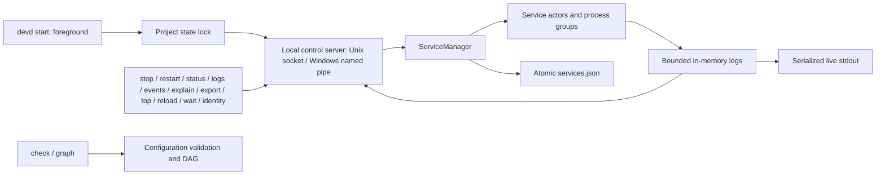
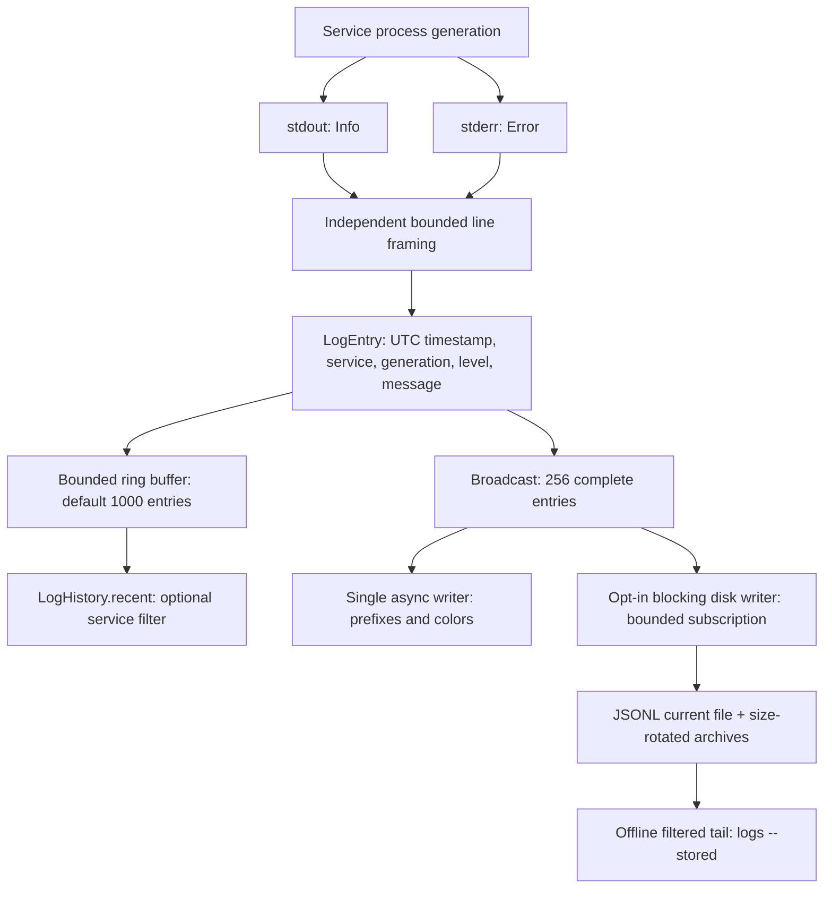

# devd - 架构设计文档

## 当前控制链路

v0.7 M3 的 `cli::export` 通过单次控制请求从活 supervisor 采集实例身份、状态快照、事件窗口和可选的内存日志。报告为状态字段白名单，省略重载失败自由文本；每个当前或近期服务的解释复用同一批事件。采样前后比较状态与事件水位，只标记观测期间是否稳定，不承诺跨来源原子快照。客户端将 JSON 先写到目标目录的临时文件，再以不覆盖方式发布，失败不会替换既有报告。

v0.7 M2 的 `cli::wait` 使用一条不重连的只读控制连接订阅 supervisor 内存快照，`core::readiness` 将所选服务的状态、PID 和代次归约成就绪报告。有探测要求 Healthy，否则要求 Running，两者均需 PID；手动重启屏障先于控制请求发布，避免旧代次误满足。manager 的独立 watch 保存停止标记、进行中的手动重启和单调递增的 reload epoch；已接受重载即增加 epoch，即使无变化或完成过快也不会被 watch 合并漏掉。拒绝的重载不触发屏障。配置读取、观测与重载提交保持 snapshot → configuration/control 的锁顺序，运行状态磁盘 schema 不变。每个实例最多 8 个等待，与最多 16 个日志/事件跟随者一起为 32 个总连接保留控制余量。客户端整体 deadline 包含连接，服务端也限制期限；断连及时释放名额，取消不持有 controller，不产生生命周期事件或磁盘写入。JSON schema 1 保留最后观测及其时间，不承诺返回时仍健康。

实例登记的阻塞写入持有状态锁直至原子替换结束；取消启动不会提前释放所有权，避免迟到的旧写入覆盖新运行记录。已有记录（含悬空链接）必须通过普通文件安全检查，才允许替换。

v0.7 M1 的 `cli::instances` 在持有 supervisor 状态锁、尚未启动服务时，将身份原子登记到项目/worktree 根目录 `.devd/instances/<instance_id>.json`。身份摘要来自配置绝对路径、规范化状态目录和 profile；run_id 复用事件运行标识，分支/提交仅为启动观测。`identity` 返回活 supervisor 持有的身份，不读取索引或 YAML。`instances` 使用有界只读 Git 命令找到当前仓库 worktree，读取有大小限制、拒绝链接/特殊文件的登记记录；最多 8 个并发、每端点 750 ms 核对完整身份。旧记录不会用来接管 PID，也不会自动删除。损坏或无法读取的索引进入 warnings/complete=false；不可达只代表端点观测失败。该模块不更改运行状态快照格式、端口或应用数据归属。

v0.4 的平台差异集中在 `platform/`、`cli/transport.rs` 与 stdout 实现中。Unix 保留进程组与 socket；Windows 在 CREATE_SUSPENDED 状态下创建服务、绑定带 KILL_ON_JOB_CLOSE 的独立 Job，再通过 ToolHelp 定位并恢复主线程，避免加入 Job 前逃逸。停止先发送定向 Ctrl+Break，超时后终止 Job；无控制台时直接终止。正常退出等待 Job 活动进程数归零，取消/Drop/父进程强杀通过 Job 句柄关闭清理。Script 与服务共用同一所有权机制。

Windows 控制端点用规范化实例路径的稳定摘要命名，管道拒绝远程客户端，显式 DACL 仅允许当前用户；first-instance 防抢占，接受连接前建立下一实例以持续持有名称。长度上限、I/O 超时和客户端额度由共同协议层保持。profile 目录在 Windows 将所有名称字节编码为十六进制并加前缀，避免设备保留名、大小写和尾点别名；Unix 保持既有路径。

状态和日志使用标准库文件锁（Unix flock、Windows LockFileEx），状态 JSON 同目录替换。安全文件打开层拒绝链接、重解析点、非普通文件与受管日志硬链接；Unix 保留 O_NOFOLLOW/O_NONBLOCK 和 0700/0600，Windows 磁盘文件继承目录 ACL。Windows stdout 用独立有界线程和取消同步 I/O，避免阻塞 Tokio 关闭；控制台通过 UTF-16 输出，重定向保留 UTF-8。Windows `check`/`start` 在执行前拒绝 Unix socket 探测，其余生命周期、资源、健康和日志逻辑跨平台共享。



`cli/mod.rs` 负责 clap 参数、配置路径和命令输出；`cli/graph.rs` 将已校验的依赖图确定性地渲染为文本、DOT 或 Mermaid，图边从前置服务指向依赖者并标注就绪条件；`cli/protocol.rs` 提供有界长度前缀 JSON；`cli/server.rs` 在同一状态锁下管理 socket、编排器与客户端；`cli/snapshot.rs` 负责离线配置副本；`cli/stdout.rs` 支持可取消的终端/管道写入；`cli/top.rs` 用独立状态轮询、日志订阅和控制请求驱动 TUI。运行控制命令通过活实例操作，离线 status 报错，不信任旧状态文件中的 PID。

默认状态目录为 `<config-dir>/.devd/<config-name>/`，可用 `--state-dir` 覆盖。服务 cwd 相对配置目录；环境文件相对服务 cwd。stop 的响应表示请求已接受，前台 supervisor 负责完成反向依赖关闭。手动 restart 通过 manager channel 停止旧 actor 并重建，保留计数/日志代次、重新检查依赖；仅当下游显式开启 `restart-on-dep-recovery` 时，目标恢复会触发后续联动。命令成功只表示指定目标的新进程已启动。

v0.3 增加单文件 `profiles` 与全局 `--profile`。`config/profile.rs` 独占文档解析、别名归一化及覆盖合并；运行时 `DevdConfig` 只包含所选结果。所有定义检查 schema，选中结果再执行依赖和就绪校验。`env`、`restart` 按字段合并，其余字段整体替换；可选字段支持 null 清除。CLI 在默认或显式运行目录下追加 `profiles/<name>/`，大写字节转义为 `~hh`，保证大小写不敏感文件系统上的不同 profile 也有不同端点。控制命令只校验名称和计算路径，不读取 YAML；服务目录、端口与应用文件不在隔离范围内。

配置快照按完整 YAML 文件保存于基础状态目录的 `snapshots/<name>.yml`，不进入 profile 子目录。保存和恢复复制原始字节，支持未完成编辑的配置；校验仍由 `check` 负责。临时文件先写入同一目录并同步，再通过不覆盖的原子发布创建目标；快照名限制为安全的小写 ASCII，恢复目标只能是原配置目录的新文件名，以维持相对路径语义。配置快照不接触 `services.json`、控制 socket 或进程；恢复不会修改运行中实例，也不会接管遗留 PID。

当前可用命令为 start、stop、restart、reload、wait、identity、instances、export、status、top、logs、events（均含 --follow / --stored）、explain、doctor、check、graph、init、snapshot，支持 TCP/HTTP/Unix Socket/Script 健康检查和 fixed/exponential 重启延时。status 提供服务主进程 CPU／RSS 采样。top 仅连接活实例，退出界面不停止服务，停止全栈必须在界面内确认；终端恢复由 RAII 处理。下方总体蓝图仍包含未来的配置监听等扩展，不能视为当前实现。

v0.6 的 `reload --dry-run [--candidate PATH] [--json]` 通过控制端点读取 supervisor 持有的当前有效配置基线。`cli::reload` 在最多两个并发 blocking 任务内读取候选普通文件（上限 1 MiB），沿用实例 profile，按候选目录解析 cwd；`core::reload` 调用与启动共用的静态配置准备函数，校验命令、探测设置、计时器和依赖图，不执行探测或读取 dotenv 内容。任务不持有 controller、状态 writer 或事件记录器；全栈 stop 优先取消等待，即使 OS 读取稍后返回也不能改变服务。并发名额由 blocking 闭包持有直到返回，避免取消后无限积累后台读取。

预览按有效服务定义比较字段；命令参数、默认值、别名、映射/依赖顺序与资源单位归一化，路径不折叠可能穿过软链接的 `..`，保留尾部目录语义。差异传播沿旧、新反向依赖边的并集遍历，visited 集合处理并集成环；旧图逆序停止层、新图正序启动层均只保留受影响服务。报告只输出字段名和原因服务，不传输完整配置。排序 JSON 的 SHA-256 标识旧/新配置，plan 摘要还绑定 run_id、profile、PID、代次及生命周期状态，不受 CPU/RSS 采样影响。它描述一次读取与快照，不锁定后续变化。`--apply --plan ID` 重读候选并在 manager 中重算计划；不匹配即拒绝，`apply_available: true` 只表示支持在线应用。

`service_manager/reload_apply.rs` 的状态机由 manager 主循环驱动，没有独立后台编排任务。静态校验及计划核对在副作用前完成；核对快照与向受影响 actor 发送 Quiescing 共用快照读锁。手动 restart 与 reload 互斥，第二次 reload 拒绝。按旧图逆序分层停止并 join 旧 actor 后，在快照写锁下切换配置订阅与服务集合；未变化 actor 保持，新 actor 按新图分层启动。Loading 控制态暂停受影响服务的自动恢复；有探测的服务要求 Healthy，其余要求 Running，每层就绪等待沿用 dependency_timeout。全栈停止优先于下一层推进。

资源监控通过 watch 接收最新阈值，在重载期间仅评估无关服务，完成后恢复全部阈值。旧 actor join 后才删除状态，避免依赖恢复与资源采样引用消失的服务。候选只更新内存，启动路径/profile、状态目录与日志选项不变。成功响应前落盘当前快照；失败/中断沿用全栈清理，不做回滚。报告与 ReloadStarted/ReloadServiceSelected/ReloadFinished 事件给出计划标识、配置是否切换和实际进度，受既有事件容量/截断约束。客户端断开或响应超时不取消已受理的动作。

资源采集由 `core::resource_monitor` 每秒通过阻塞线程池读取受管主 PID 的 sysinfo 指标，生命周期仍由 service actor 独占。监控 future 随 manager 驱动、退出时停止轮询；在途 OS 读取只持有局部数据，不能在退出后写回状态。采样以 PID、started_at、restart_count 核对进程代次，actor 发布健康状态时保留同代指标，退出时清除。CPU 首次采样只建立基线；不可用指标保持空值。缓存随代次淘汰，Linux 线程枚举关闭；不统计子进程。可选 `limits` 对采样值执行跨阈值告警与恢复日志，不执行强制限制。

`core::events` 是 v0.5 的结构化生命周期事实源。每个 supervisor 实例创建独立 `run_id`，actor、manager 和资源监控器在决策与观测发生处写入单调序号事件；`event_generation` 标记一次服务进程尝试，`cause` 只引用同一运行中较早的事件。记录器只保留有界内存历史并提供有界 broadcast 订阅，lag 必须由消费者显式处理；它不持有进程、不驱动重试，也不在状态锁内等待磁盘。事件中的进程错误、探测失败和资源证据均为脱敏枚举，不保存命令、URL、环境文件内容或脚本错误文本。运行快照继续负责最新状态，新字段带 serde 默认值以兼容旧状态文件。

`core::events::query` 定义事件类型筛选、运行/序号游标和带 schema 版本的批次；`cli::events` 负责文本/JSON 输出及控制协议订阅。首批历史与 live receiver 在发布锁内一起取得，后续批次即使无筛选匹配也更新水位。内存保留 1024 条、单事件最多 16 KiB；订阅缓冲 256 条，落后显式报告缺口并断开。日志与事件共享 16 个长连接名额，控制命令保留独立接入空间。在线查询不重新解析 YAML。

`storage` 统一提供带锁、安全文件访问、有界记录读取、尾部修复与轮转的 JSONL 底层，日志与事件各自持有独立目录、schema 和订阅。`core::events::storage` 仅在 `start --persist-events` 时开启，在阻塞线程中追加运行上下文、事件、缺口与排空结束标记；默认单文件 10 MiB、3 份归档。启动打开失败阻止服务启动；运行写入失败只停用本次事件 writer，通过 watch 发布 `failed`，stderr 限时异步报告，不停止服务。writer 排空结束前持有状态锁租约。`events --stored` 使用共享读锁，在单记录 64 KiB、结果最多 1000 条与 128 个缺口的边界内扫描；明确报告不完整运行、保留窗口缺失和未完成尾记录，拒绝完整损坏记录及不支持的 schema。事件和应用日志的写盘失败策略分别由 server 管理。

`core::diagnostics::explain` 将同一运行的状态快照和 `EventBatch` 转为版本化报告，在线请求由控制协议返回，`--stored` 在 writer 停止后读取保留历史。结论只由结构化事件和当前状态决定，证据包含序号、类型、代次、因果引用与时间；普通生命周期事件也会在无法判断根因时作为最近事实展示。历史缺口降低 `complete` 并进入报告。该路径不探测、不启动或重启服务，也不执行 next steps；文本与 JSON 共用同一报告模型。

`limits.on-exceed` 默认为 `warn`；仅显式 `restart` 授权超限重启，与 `restart.policy: never` 冲突。采样器按进程代次分别维护 CPU/RSS 连续超限次数；同一指标 3 次有效采样超限时，在同一快照锁内写入 `resource_restart_reason`。缺样及正常值打断该指标的连续计数，重复快照不计数。决定保持到该代次退出，避免 watch 合并更新丢失触发；actor 的同代健康更新保留它，退出或换代清除它。actor 核对代次和授权后执行既有停止、日志排空、退避、依赖等待与累计预算流程。停止及进程退出优先于资源触发，资源更新不取消在途健康探测；预算耗尽保留原因并清理全栈。持久化快照中的原因仅用于诊断，不接管旧 PID。

依赖联动由 `core::dependency_recovery` 比较依赖进程代次：actor 在通过启动就绪检查的同一个快照读锁内记录直接依赖的 PID、started_at、restart_count。运行期间只在代次变化且所有依赖满足各自条件时停止旧进程组，复用自动重启的退避、预算、依赖等待和日志排空。基线随下一次就绪检查更新，不依赖 watch 保留每次中间事件；单纯健康波动不会触发。每个服务独立恢复，非全图原子操作。监听其他服务状态时保留在途健康探测 future，防止频繁快照更新取消探测。开启联动要求存在依赖且自动策略不是 never；次数耗尽沿用 Failed 与全栈清理语义。

`core::path_requirements` 复用同一个只读 evaluator 为启动前的 `service.requires` 和 `doctor` 检查文件、目录及软链接条件。相对路径按有效服务 cwd 解析；启动时在进程依赖就绪后、spawn 前检查。失败拒绝启动并沿用全栈清理。Unix 打开文件带 O_NONBLOCK 并复查句柄类型，避免路径在 metadata 与 open 之间被替换成 FIFO 后阻塞。

v0.6 的 `core::path_monitor` 仅在服务显式设置 `monitor-requires: true` 时启用，允许 `restart.policy: never`。每次阻塞线程池检查完成后等待一秒，每条条件连续两次相同变化才发布 `path-condition-changed` 及 WARN/INFO 日志，重复失效、恢复和原子替换中仍成立的条件均不刷屏。监测 future 由 actor 在一整个进程代次内驱动，跨健康检查及快照更新保持；停止、退出、换代时直接取消。在途 OS 调用只持有路径与 cwd，没有记录器或日志句柄，返回后无法给旧代次补发事件。监测不改变状态、健康、重启预算，也不执行文件修复。

路径事件保存 requires 索引、类型、解析路径与稳定失败分类（null 表示恢复），不保存文件内容或解析后的链接目标，沿用现有事件容量和截断规则。`explain` 按运行实例与进程代次引用每条条件的最近观测，恢复时附上保留的最近失效，并明确观测不等于应用故障因果；历史缺口照常显示。磁盘留存仍由独立的 `--persist-events` 授权。

## 系统架构图

```
┌─────────────────────────────────────────────────────────────────────┐
│                          devd CLI (User Entry)                       │
│  ┌──────────┬──────────┬──────────┬──────────┬──────────┬─────────┐ │
│  │  init    │  start   │  stop    │  logs    │  status  │  graph  │ │
│  └──────────┴──────────┴──────────┴──────────┴──────────┴─────────┘ │
└────────────────────────────────┬────────────────────────────────────┘
                                 │ clap::Parser
                                 ▼
┌─────────────────────────────────────────────────────────────────────┐
│                        Core Service Manager                          │
│                                                                       │
│  ┌──────────────────┐  ┌──────────────────┐  ┌──────────────────┐  │
│  │ Config Loader    │  │ Dependency Graph │  │ State Manager    │  │
│  │ • Parse YAML     │  │ • Build DAG      │  │ • services.json  │  │
│  │ • Env substitution│ │ • Topological    │  │ • PID tracking   │  │
│  │ • Validation     │  │   sort           │  │ • Status cache   │  │
│  └──────────────────┘  └──────────────────┘  └──────────────────┘  │
│                                                                       │
│  ┌────────────────────────────────────────────────────────────────┐ │
│  │                     Service Orchestrator                        │ │
│  │  • Start/Stop/Restart services in dependency order             │ │
│  │  • Signal handling (SIGTERM → graceful shutdown)               │ │
│  │  • Parallel startup for independent services                   │ │
│  └────────────────────────────────────────────────────────────────┘ │
└────────────────────────────────┬────────────────────────────────────┘
                                 │
        ┌────────────────────────┼────────────────────────┐
        ▼                        ▼                        ▼
┌──────────────────┐  ┌──────────────────┐  ┌──────────────────┐
│  Service Task 1  │  │  Service Task 2  │  │  Service Task N  │
│  (postgres)      │  │  (backend)       │  │  (frontend)      │
├──────────────────┤  ├──────────────────┤  ├──────────────────┤
│ • Process Handle │  │ • Process Handle │  │ • Process Handle │
│ • Health Check   │  │ • Health Check   │  │ • Health Check   │
│ • Log Collector  │  │ • Log Collector  │  │ • Log Collector  │
│ • Restart Policy │  │ • Restart Policy │  │ • Restart Policy │
└──────┬───────────┘  └──────┬───────────┘  └──────┬───────────┘
       │                     │                      │
       │ tokio::process      │                      │
       ▼                     ▼                      ▼
┌──────────────┐      ┌──────────────┐      ┌──────────────┐
│  postgres    │      │  npm run dev │      │  vite dev    │
│  (Child PID) │      │  (Child PID) │      │  (Child PID) │
└──────────────┘      └──────────────┘      └──────────────┘
```

---

## 核心模块架构

```
┌──────────────────────────────────────────────────────────────────────┐
│                             devd Binary                               │
│                                                                        │
│  ┌─────────────────────────────────────────────────────────────────┐ │
│  │                         CLI Layer (clap)                         │ │
│  │  • Command parsing                                               │ │
│  │  • Argument validation                                           │ │
│  │  • Output formatting (colored terminal)                          │ │
│  └────────────────────────────┬─────────────────────────────────────┘ │
│                               │                                        │
│  ┌────────────────────────────▼─────────────────────────────────────┐ │
│  │                      Application Layer                            │ │
│  │                                                                    │ │
│  │  ┌───────────────┐  ┌───────────────┐  ┌───────────────┐        │ │
│  │  │ StartCommand  │  │ StopCommand   │  │ LogsCommand   │        │ │
│  │  │ • Load config │  │ • Send signal │  │ • Query logs  │  ...   │ │
│  │  │ • Start mgr   │  │ • Wait exit   │  │ • Stream out  │        │ │
│  │  └───────────────┘  └───────────────┘  └───────────────┘        │ │
│  └────────────────────────────┬─────────────────────────────────────┘ │
│                               │                                        │
│  ┌────────────────────────────▼─────────────────────────────────────┐ │
│  │                         Domain Layer                              │ │
│  │                                                                    │ │
│  │  ┌──────────────────────────────────────────────────────────┐   │ │
│  │  │                   ServiceManager                          │   │ │
│  │  │  • Service lifecycle orchestration                        │   │ │
│  │  │  • Event loop (Tokio runtime)                             │   │ │
│  │  │  • Task spawning and coordination                         │   │ │
│  │  └──────────────┬───────────────────────────────────────────┘   │ │
│  │                 │                                                 │ │
│  │  ┌──────────────▼───────────────┐  ┌────────────────────────┐  │ │
│  │  │     DependencyResolver        │  │    HealthChecker       │  │ │
│  │  │  • Build DAG from config      │  │  • HTTP probe          │  │ │
│  │  │  • Topological sort           │  │  • TCP probe           │  │ │
│  │  │  • Cycle detection            │  │  • Socket probe        │  │ │
│  │  └──────────────────────────────┘  │  • Script probe        │  │ │
│  │                                     └────────────────────────┘  │ │
│  │  ┌──────────────────────────────┐  ┌────────────────────────┐  │ │
│  │  │      LogCollector             │  │    RestartPolicy       │  │ │
│  │  │  • Capture stdout/stderr      │  │  • Exponential backoff │  │ │
│  │  │  • Ring buffer storage        │  │  • Max attempts        │  │ │
│  │  │  • Timestamp + level parsing  │  │  • Cooldown timer      │  │ │
│  │  └──────────────────────────────┘  └────────────────────────┘  │ │
│  │                                                                   │ │
│  │  ┌──────────────────────────────┐  ┌────────────────────────┐  │ │
│  │  │      ProcessManager           │  │    StateStore          │  │
│  │  │  • tokio::process::Command    │  │  • services.json       │  │
│  │  │  • Signal forwarding          │  │  • PID registry        │  │
│  │  │  • Graceful shutdown          │  │  • Restart counters    │  │
│  │  └──────────────────────────────┘  └────────────────────────┘  │ │
│  └──────────────────────────────────────────────────────────────────┘ │
│                                                                        │
│  ┌─────────────────────────────────────────────────────────────────┐ │
│  │                      Infrastructure Layer                        │ │
│  │                                                                   │ │
│  │  ┌──────────────┐  ┌──────────────┐  ┌──────────────┐          │ │
│  │  │ ConfigLoader │  │ LogStorage   │  │ FileWatcher  │          │ │
│  │  │ (serde_yaml) │  │ (ring buffer)│  │ (notify)     │          │ │
│  │  └──────────────┘  └──────────────┘  └──────────────┘          │ │
│  │                                                                   │ │
│  │  ┌──────────────┐  ┌──────────────┐  ┌──────────────┐          │ │
│  │  │ HttpClient   │  │ SystemInfo   │  │ SignalHandler│          │ │
│  │  │ (reqwest)    │  │ (sysinfo)    │  │ (tokio)      │          │ │
│  │  └──────────────┘  └──────────────┘  └──────────────┘          │ │
│  └──────────────────────────────────────────────────────────────────┘ │
└──────────────────────────────────────────────────────────────────────┘
```

---

## 数据流图

### 1. 服务启动流程

```
┌──────────┐
│ devd     │
│ start    │
└────┬─────┘
     │
     ▼
┌──────────────────┐
│ Load devd.yml    │──┐
└────┬─────────────┘  │
     │                │ Validation Error
     ▼                ▼
┌──────────────────┐  ┌──────────┐
│ Validate Config  │─>│ Exit(1)  │
└────┬─────────────┘  └──────────┘
     │ OK
     ▼
┌──────────────────┐
│ Build Dependency │
│ Graph (DAG)      │
└────┬─────────────┘
     │
     ▼
┌──────────────────┐
│ Topological Sort │──┐
└────┬─────────────┘  │
     │                │ Cycle Detected
     ▼                ▼
┌──────────────────┐  ┌──────────┐
│ Cycle Detection  │─>│ Exit(1)  │
└────┬─────────────┘  └──────────┘
     │ No Cycle
     ▼
┌──────────────────────────────────────┐
│ Start Services in Topological Order  │
└────┬─────────────────────────────────┘
     │
     ├──> Service 1 (postgres)
     │    ├─> Spawn Process
     │    ├─> Wait for SocketReady
     │    └─> Start Health Check Loop
     │
     ├──> Service 2 (redis)
     │    ├─> Spawn Process
     │    ├─> Wait for TcpReady
     │    └─> Start Health Check Loop
     │
     └──> Service 3 (backend)
          ├─> Wait for dependencies (postgres, redis)
          ├─> Spawn Process
          ├─> Wait for HttpReady
          └─> Start Health Check Loop
```

---

### 2. 健康检查流程

```
┌─────────────────────┐
│ Health Check Task   │ (Tokio task per service)
│ (Interval: 10s)     │
└──────────┬──────────┘
           │
           ▼
      ┌────────┐
      │ Tick   │<────────────┐
      └────┬───┘             │
           │                 │
           ▼                 │
    ┌───────────────┐        │
    │ Perform Check │        │
    │ (HTTP/TCP/...)│        │
    └───────┬───────┘        │
            │                │
    ┌───────┴───────┐        │
    ▼               ▼        │
┌────────┐      ┌────────┐  │
│ Success│      │ Failure│  │
└───┬────┘      └───┬────┘  │
    │               │        │
    ▼               ▼        │
┌────────────┐  ┌──────────────────┐
│ Reset      │  │ Increment        │
│ fail_count │  │ fail_count       │
└─────┬──────┘  └────┬─────────────┘
      │              │
      │              ▼
      │         ┌────────────────┐    No
      │         │ fail_count >=  │────┘
      │         │ max_retries?   │
      │         └────┬───────────┘
      │              │ Yes
      │              ▼
      │         ┌──────────────┐
      │         │ Trigger      │
      │         │ Restart      │
      │         └──────────────┘
      │
      └──────────────┘
```

---

### 3. 服务重启流程

```
┌────────────────┐
│ Restart        │
│ Triggered      │
└───────┬────────┘
        │
        ▼
┌─────────────────┐
│ Send SIGTERM    │
│ to Process      │
└───────┬─────────┘
        │
        ▼
┌─────────────────┐
│ Wait 5s for     │
│ Graceful Exit   │
└───────┬─────────┘
        │
    ┌───┴────┐
    ▼        ▼
┌────────┐  ┌────────┐
│ Exited │  │Timeout │
└───┬────┘  └───┬────┘
    │           │
    │           ▼
    │      ┌──────────┐
    │      │ SIGKILL  │
    │      └────┬─────┘
    │           │
    └───────┬───┘
            │
            ▼
   ┌─────────────────┐
   │ Check Restart   │
   │ Policy          │
   └────────┬────────┘
            │
    ┌───────┴────────┐
    ▼                ▼
┌──────────┐   ┌─────────────┐
│ attempts │   │ attempts >  │──> Give Up
│ <= max   │   │ max         │
└────┬─────┘   └─────────────┘
     │
     ▼
┌─────────────────┐
│ Calculate       │
│ Backoff Delay   │
│ (Exponential)   │
└────────┬────────┘
         │
         ▼
┌─────────────────┐
│ Sleep(delay)    │
└────────┬────────┘
         │
         ▼
┌─────────────────┐
│ Spawn Process   │
│ Again           │
└────────┬────────┘
         │
         ▼
┌─────────────────┐
│ Wait for        │
│ Health Check    │
└─────────────────┘
```

---

### 4. 日志收集流程



完整条目在读取管道侧生成，历史插入与 live 分发顺序一致。单行默认最多保留 16 KiB，超长行标记截断；EOF、取消和读取错误记录尾部一次。慢终端只丢失完整 live 条目并报告 WARN，不阻塞采集或服务管理。CLI start 输出实时日志；logs 在 supervisor 端按服务、级别、固定时间下界和字面关键词筛选，`--tail` 对匹配结果计数，follow 的历史快照与订阅仍在同一锁内完成，并沿用相同条件筛选实时条目。

v0.4 的 `start --persist-logs` 在实例状态目录的 `logs/` 写 JSONL，不改变默认内存模式。CLI 在持有状态锁且启动服务前打开存储；独立 blocking writer 持有磁盘独占锁及状态锁租约，消费同一个有界 broadcast，落后时写入 WARN 缺口记录，I/O 失败触发有序关停。正常退出等待磁盘队列排空和 `sync_data`，不使用终端 writer 的一秒超时。强杀不保证未同步数据。

当前文件为 `current.jsonl`；轮转通过逆序 rename 保留 `archive-1.jsonl`（最新）至 `archive-N.jsonl`，默认单文件 10 MiB、3 份归档。跨运行追加，降低保留数会删除多余归档；完整记录不跨文件。新目录/文件权限为 0700/0600，拒绝日志目录符号链接、受管文件符号链接/硬链接及非普通文件。异常中断的当前文件尾部在有界扫描后截掉，并追加诊断；不会静默忽略完整损坏记录。轮转不是多文件事务，强杀期间可能留下编号缺口，读取按已有文件顺序进行。

`logs --stored` 通过 blocking pool 获取磁盘共享锁，按最旧归档至当前文件流式读取，复用 LogFilter 并用有界队列保留匹配的最新条目。它不读 YAML、不接管进程；持久化 writer 仍运行时明确报错，不能搭配 follow。正常 `logs` 继续读取本次运行内存，不隐式切换数据源。磁盘查询每条 JSON 也有大小上限，避免损坏文件导致无界分配。

---

## 目录结构

```
devd/
├── Cargo.toml                 # Rust project manifest
├── Cargo.lock
├── README.md
├── ARCHITECTURE.md            # Architecture diagrams
├── AGENTS.md                  # AI agent collaboration rules
│
├── src/
│   ├── main.rs                # Entry point
│   │
│   ├── cli/                   # Implemented CLI layer
│   │   ├── mod.rs             # clap, paths, commands and presentation
│   │   ├── doctor.rs          # Read-only local launch prerequisite report
│   │   ├── graph.rs           # Text, DOT and Mermaid dependency views
│   │   ├── reload.rs          # Candidate loading, preview and explicit application
│   │   ├── protocol.rs        # Bounded local request/response transport
│   │   ├── server.rs          # Foreground runtime and client lifecycle
│   │   └── stdout.rs          # Cancellable terminal and pipe writes
│   │
│   ├── core/                  # Domain layer
│   │   ├── mod.rs
│   │   ├── service_manager.rs # Main orchestrator
│   │   ├── service_manager/reload_apply.rs # Stop/commit/start state machine
│   │   ├── service_task.rs    # Per-service task
│   │   ├── dependency.rs      # Dependency graph + topological sort
│   │   ├── reload.rs          # Effective config diff, impact layers, identities and reports
│   │   ├── health_check.rs    # Health check implementations
│   │   ├── restart_policy.rs  # Restart strategy
│   │   └── process_manager.rs # Process spawn/kill/signal
│   │
│   ├── logging/               # Implemented: collection, output and persistence
│   │   ├── mod.rs             # LogEntry, LogLevel, public interfaces
│   │   ├── collector.rs       # Bounded line framing + ring history
│   │   ├── output.rs          # Serial async writer + colors
│   │   └── storage.rs         # Bounded JSONL rotation and offline queries
│   │
│   ├── config/                # Configuration
│   │   ├── mod.rs
│   │   ├── loader.rs          # YAML parsing + validation
│   │   ├── schema.rs          # Config structs (serde models)
│   │   └── env_subst.rs       # Environment variable substitution
│   │
│   ├── storage/               # State persistence
│   │   ├── mod.rs
│   │   ├── state_store.rs     # services.json read/write
│   │   └── log_storage.rs     # Log file rotation
│   │
│   └── utils/                 # Infrastructure utilities
│       ├── mod.rs
│       ├── http_client.rs     # HTTP health check client
│       ├── system_info.rs     # CPU/memory stats (sysinfo)
│       └── signal_handler.rs  # SIGTERM/SIGINT handling
│
├── tests/
│   ├── cli.rs                 # Real binary lifecycle and failure tests
│   ├── reload.rs              # Live preview, selective application and failure tests
│   ├── integration.rs         # Full MVP scenarios through the public CLI
│   ├── support/               # Bounded command harness and local HTTP mock
│   ├── integration/           # Integration tests
│   │   ├── basic_start_stop.rs
│   │   ├── dependency_order.rs
│   │   ├── auto_restart.rs
│   │   └── health_check.rs
│   └── fixtures/              # Test configs
│       ├── simple.yml
│       ├── with-deps.yml
│       └── mock-server.sh
│
└── examples/
    ├── devd.yml               # Example config
    └── mock-service/          # Demo HTTP server for testing
        └── server.js
```

---

## 关键数据结构

### Config Schema (Rust)

```rust
// src/config/schema.rs

#[derive(Debug, Deserialize)]
pub struct DevdConfig {
    pub version: String,
    pub services: HashMap<String, ServiceConfig>,
}

#[derive(Debug, Deserialize)]
pub struct ServiceConfig {
    pub command: String,
    #[serde(default)]
    pub listen: Vec<SocketAddr>,
    #[serde(default)]
    pub cwd: Option<PathBuf>,
    #[serde(default)]
    pub env: HashMap<String, String>,
    #[serde(default)]
    pub env_file: Option<PathBuf>,
    #[serde(default)]
    pub depends_on: Vec<Dependency>,
    #[serde(default)]
    pub healthcheck: Option<HealthCheck>,
    #[serde(default)]
    pub restart: RestartPolicy,
    #[serde(default)]
    pub limits: Option<ResourceLimits>,
}

#[derive(Debug, Deserialize)]
pub struct Dependency {
    pub service: String,
    #[serde(default)]
    pub condition: DependencyCondition,
}

#[derive(Debug, Deserialize)]
#[serde(rename_all = "snake_case")]
pub enum DependencyCondition {
    Started,
    SocketReady,
    TcpReady,
    HttpReady,
}

#[derive(Debug, Deserialize)]
#[serde(tag = "type")]
pub enum HealthCheck {
    #[serde(rename = "http")]
    Http {
        url: String,
        interval: u64,
        timeout: u64,
        retries: u32,
    },
    #[serde(rename = "tcp")]
    Tcp {
        port: u16,
        interval: u64,
        timeout: u64,
    },
    #[serde(rename = "socket")]
    Socket {
        path: PathBuf,
        interval: u64,
    },
}

#[derive(Debug, Deserialize)]
pub struct RestartPolicy {
    pub policy: RestartPolicyType,
    pub backoff: BackoffType,
    pub initial_delay: u64,
    pub max_delay: u64,
    pub max_attempts: u32,
}

#[derive(Debug, Deserialize)]
#[serde(rename_all = "kebab-case")]
pub enum RestartPolicyType {
    Always,
    OnFailure,
    Never,
}

#[derive(Debug, Deserialize)]
#[serde(rename_all = "lowercase")]
pub enum BackoffType {
    Fixed,
    Exponential,
}
```

---

### Service Task State Machine

当前版本由以下模块实现生命周期所有权：

| 模块 | 所有权与接口 |
| --- | --- |
| `core/service_manager.rs` | 校验全栈、并发创建服务任务、状态订阅、SIGINT/SIGTERM、失败回滚和反向拓扑关闭；`ServiceController` 传递手动重启请求并返回启动结果 |
| `core/service_task.rs` | 私有服务任务，独占 `ManagedProcess`，等待依赖、观察退出与健康、固定延时重启、并发调用日志采集器排空 stdout/stderr |
| `logging/collector.rs` | 独立流分行、有界行长、全栈环形历史和完整日志条目分发 |
| `logging/output.rs` | 单个异步 writer 串行输出、稳定颜色、控制字符转义和 live 丢失诊断 |
| `core/state_store.rs` | 独占状态锁和原子 JSON 替换；锁在未结束的状态写入与服务任务中保持有效 |
| `core/health_check.rs` | 不可变探测配置和复用 HTTP client，串行周期探测与连续失败计数 |

```text
Pending -> Starting -> Running -> Healthy / Unhealthy
进程退出或健康失败 -> 停止旧代 -> Restarting -> 再次等待依赖 -> Starting
终止失败 -> Failed -> manager 清理其他服务
关闭 -> 全栈 Quiescing -> 反向分层 Stopping -> Stopped
```

状态快照保存 PID、开始时间、累计重启次数、连续失败次数和退出/错误诊断。watch 状态只保留最新值，不是可靠的历史事件队列；管道读取侧先拼成完整 LogEntry，再写入有界历史和 broadcast，消费者处理 Lagged。没有健康配置的存活服务为 Running。MVP 仅实现 fixed 重启，v0.2 开发版增加 Unix Socket 探测、有上限且可取消的指数退避，以及可选的依赖进程恢复联动重启。当前使用边界见 [README](README.zh-CN.md#用之前知道这几件事)。

---

## 并发模型

```
┌───────────────────────────────────────────────┐
│          Tokio Runtime (Single Thread)        │
│                                               │
│  ┌─────────────────────────────────────────┐ │
│  │         Main Event Loop                 │ │
│  │  • Signal handling                      │ │
│  │  • CLI command dispatch                 │ │
│  └───────────┬─────────────────────────────┘ │
│              │                                 │
│  ┌───────────▼───────────────────────┐       │
│  │  ServiceManager::run()            │       │
│  │  • Spawn N service tasks          │       │
│  │  • Await completion               │       │
│  └───────────┬───────────────────────┘       │
│              │                                 │
│   ┌──────────┼──────────┐                    │
│   ▼          ▼          ▼                    │
│ ┌────────┐ ┌────────┐ ┌────────┐            │
│ │Service │ │Service │ │Service │            │
│ │Task 1  │ │Task 2  │ │Task N  │            │
│ └───┬────┘ └───┬────┘ └───┬────┘            │
│     │          │          │                  │
│   ┌─┴──────────┴──────────┴─┐               │
│   │  Concurrent Execution    │               │
│   │  (tokio::spawn for each) │               │
│   └──────────────────────────┘               │
└───────────────────────────────────────────────┘
```

**说明**：
- 服务任务支持单线程与多线程 Tokio 运行时；当前 CLI 使用 `#[tokio::main]` 多线程运行时
- 每个服务是独立的异步任务（`tokio::spawn`）
- 健康检查、日志收集、重启策略都是该任务内的 sub-task
- 每个服务独占进程句柄；watch 传递最新状态和关闭阶段，broadcast 传递完整日志条目，不在共享锁内等待网络、管道或终端 I/O

---

## 部署架构

```
┌──────────────────────────────────────┐
│  Developer Machine                   │
│                                      │
│  ┌────────────────────────────────┐ │
│  │  Terminal                      │ │
│  │  $ devd start                  │ │
│  └──────────┬─────────────────────┘ │
│             │                        │
│  ┌──────────▼─────────────────────┐ │
│  │  devd Process                  │ │
│  │  PID: 12345                    │ │
│  │  Memory: ~30MB                 │ │
│  └──────────┬─────────────────────┘ │
│             │                        │
│     ┌───────┼───────┐               │
│     ▼       ▼       ▼               │
│  ┌──────┐┌──────┐┌──────┐          │
│  │postgres││backend││frontend│      │
│  │PID 123││PID 456││PID 789│       │
│  └──────┘└──────┘└──────┘          │
│                                      │
│  ┌────────────────────────────────┐ │
│  │  ~/.devd/                      │ │
│  │  ├── state/services.json       │ │
│  │  └── logs/                     │ │
│  └────────────────────────────────┘ │
└──────────────────────────────────────┘
```

**说明**：
- devd 是前台进程（不是 daemon），用户 Ctrl+C 即退出
- 所有子服务是 devd 的子进程（`kill_on_drop` 保证清理）
- 状态文件持久化用于诊断；不恢复或接管旧进程，不对遗留 PID 发信号

---

## 扩展点设计

### 1. 健康检查插件

v0.4 通过 `healthcheck: {type: script, command: ...}` 加载外部命令，退出码 0 表示健康。使用进程退出状态作为扩展接口，不加载动态库或引入插件注册中心。`HealthChecker::for_service` 固定服务 cwd/env/env-file 上下文，并统一解析相对 socket 路径；直接 `new` 的脚本使用当前目录及继承环境。

每次探测复用 `ManagedProcess` 的环境加载、无隐式 shell 的参数解析与独立进程组；stdin/stdout/stderr 均为 null。单次 timeout 覆盖环境读取、执行和正常组清理；超时或取消通过 Drop 向组发送 SIGKILL，Tokio 尽力回收主进程。正常完成等待组清理，保留非零退出、信号和执行错误作为失败原因。探测命令不应自行脱离进程组。串行探测、失败阈值、自动重启和日志排空等仍由既有 monitor/actor 管理；`script-ready` 要求前置服务配置 Script 探测，并复用依赖就绪及恢复语义。静态 check/graph 不执行命令；脚本按当前用户权限运行。

### 2. 日志处理插件

```rust
// 用户可自定义日志处理（例如发送到 Loki、ElasticSearch）
pub trait LogSink: Send + Sync {
    async fn write(&self, entry: &LogEntry) -> Result<()>;
}

// 内置实现
pub struct StdoutSink { ... }
pub struct FileSink { ... }

// 未来扩展
// pub struct LokiSink { ... }
```

---

## 性能指标目标

| 指标 | 目标值 | 测量方法 |
|------|--------|----------|
| devd 内存占用 | < 50 MB | `ps aux | grep devd` |
| devd CPU 占用（空闲） | < 1% | `top -pid <devd_pid>` |
| 启动 10 个服务耗时 | < 5s | `time devd start` |
| 日志吞吐量 | > 10k lines/s | 压测工具 + 计时 |
| 健康检查延迟 | < 100ms (HTTP) | 日志时间戳对比 |

---

## 安全考量

### 1. 环境变量注入
- 配置文件中的 `${VAR}` 只替换已设置的环境变量
- 未设置的变量报错（防止意外使用空值）
- 不支持命令执行（`$(cmd)`），只替换变量

### 2. 进程隔离
- 子进程继承 devd 的用户权限（不提权）
- 不支持以不同用户运行服务（避免权限问题）
- 提供主进程 CPU／RSS 监控及可选阈值告警；不提供强制资源限制

### 3. 日志脱敏（未来）
- 配置敏感字段白名单（`DATABASE_URL`、`API_KEY`）
- 日志输出时自动 mask

---

## 参考架构

**类似项目架构对比**：

| 项目 | 语言 | 架构风格 | 并发模型 | 判断 |
|------|------|----------|----------|------|
| pm2 | Node.js | 单进程 + 事件循环 | 单线程异步 | 简洁但功能弱 |
| foreman | Ruby | 单进程 + 多线程 | 线程池 | 简单但无健康检查 |
| hivemind | Go | 单进程 + goroutines | CSP 并发 | 轻量但依赖图弱 |
| systemd | C | 多进程 + D-Bus | 多进程 IPC | 强大但复杂 |
| **devd** | Rust | 单进程 + async | Tokio | ✅ 平衡性能和功能 |

---

## 总结

**架构核心思想**：
1. **简单**：单进程守护，避免复杂的 IPC
2. **异步**：Tokio 并发模型，高效管理多服务
3. **模块化**：清晰的分层架构，易于测试和扩展
4. **跨平台**：Rust + 成熟库，一次编写处处运行

**技术亮点**：
- 依赖图驱动的启动顺序
- 多层健康检查 + 自动重启
- 统一日志流 + 彩色输出
- 轻量、快速、易用
