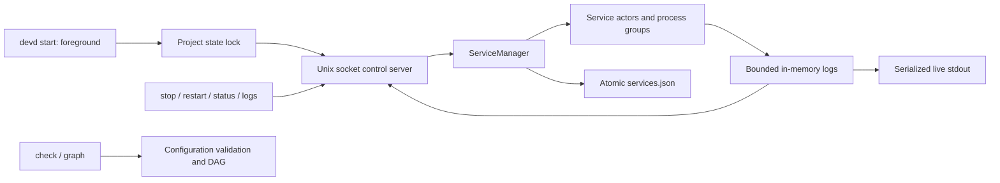
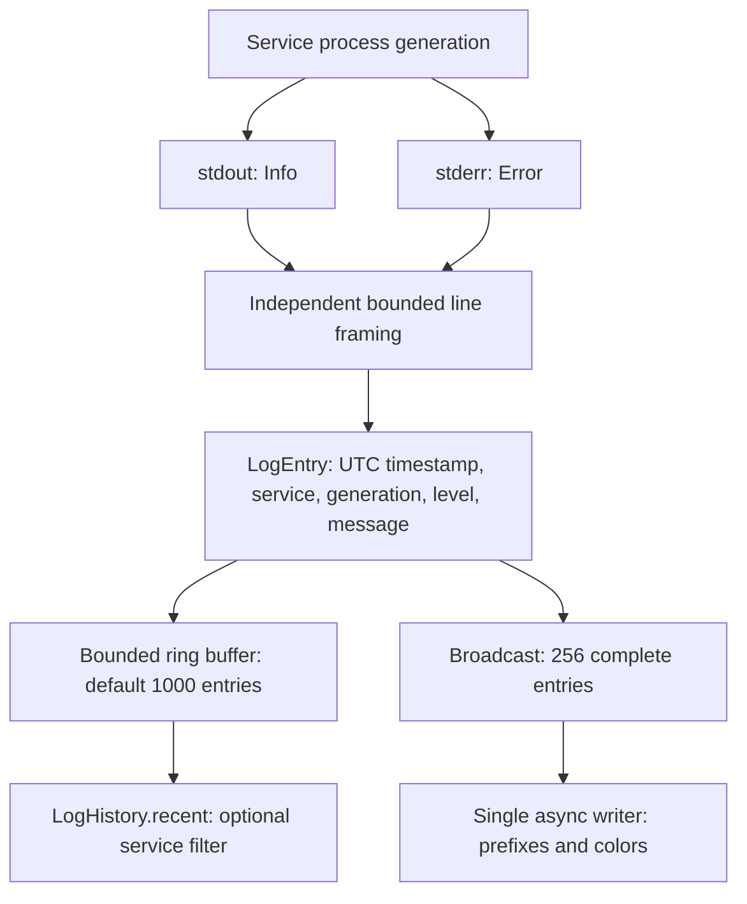

# devd - 架构设计文档

## 当前 MVP 控制链路



`cli/mod.rs` 负责 clap 参数、配置路径和命令输出；`cli/protocol.rs` 提供有界长度前缀 JSON；`cli/server.rs` 在同一状态锁下管理 socket、编排器与客户端；`cli/snapshot.rs` 负责离线配置副本；`cli/stdout.rs` 支持可取消的终端/管道写入。运行控制命令通过活实例操作，离线 status 报错，不信任旧状态文件中的 PID。

默认状态目录为 `<config-dir>/.devd/<config-name>/`，可用 `--state-dir` 覆盖。服务 cwd 相对配置目录；环境文件相对服务 cwd。stop 的响应表示请求已接受，前台 supervisor 负责完成反向依赖关闭。手动 restart 通过 manager channel 停止旧 actor 并重建，保留计数/日志代次、重新检查依赖；仅当下游显式开启 `restart-on-dep-recovery` 时，目标恢复会触发后续联动。命令成功只表示指定目标的新进程已启动。

v0.3 开发分支增加单文件 `profiles` 与全局 `--profile`。`config/profile.rs` 独占文档解析、别名归一化及覆盖合并；运行时 `DevdConfig` 只包含所选结果。所有定义检查 schema，选中结果再执行依赖和就绪校验。`env`、`restart` 按字段合并，其余字段整体替换；可选字段支持 null 清除。CLI 在默认或显式运行目录下追加 `profiles/<name>/`，大写字节转义为 `~hh`，保证大小写不敏感文件系统上的不同 profile 也有不同端点。控制命令只校验名称和计算路径，不读取 YAML；服务目录、端口与应用文件不在隔离范围内。

配置快照按完整 YAML 文件保存于基础状态目录的 `snapshots/<name>.yml`，不进入 profile 子目录。保存和恢复复制原始字节，支持未完成编辑的配置；校验仍由 `check` 负责。临时文件先写入同一目录并同步，再通过不覆盖的原子发布创建目标；快照名限制为安全的小写 ASCII，恢复目标只能是原配置目录的新文件名，以维持相对路径语义。配置快照不接触 `services.json`、控制 socket 或进程；恢复不会修改运行中实例，也不会接管遗留 PID。

当前可用命令为 start、stop、restart、status、logs（含 --follow）、check、graph、init、snapshot，支持 TCP/HTTP/Unix Socket 健康检查和 fixed/exponential 重启延时。当前开发分支的 status 增加服务主进程 CPU／RSS 采样。下方总体蓝图仍包含未来的 Script 健康检查、配置监听等扩展，不能视为当前实现。

资源采集由 `core::resource_monitor` 每秒通过阻塞线程池读取受管主 PID 的 sysinfo 指标，生命周期仍由 service actor 独占。监控 future 随 manager 驱动、退出时停止轮询；在途 OS 读取只持有局部数据，不能在退出后写回状态。采样以 PID、started_at、restart_count 核对进程代次，actor 发布健康状态时保留同代指标，退出时清除。CPU 首次采样只建立基线；不可用指标保持空值。缓存随代次淘汰，Linux 线程枚举关闭；不统计子进程、不执行资源限制。

依赖联动由 `core::dependency_recovery` 比较依赖进程代次：actor 在通过启动就绪检查的同一个快照读锁内记录直接依赖的 PID、started_at、restart_count。运行期间只在代次变化且所有依赖满足各自条件时停止旧进程组，复用自动重启的退避、预算、依赖等待和日志排空。基线随下一次就绪检查更新，不依赖 watch 保留每次中间事件；单纯健康波动不会触发。每个服务独立恢复，非全图原子操作。监听其他服务状态时保留在途健康探测 future，防止频繁快照更新取消探测。开启联动要求存在依赖且自动策略不是 never；次数耗尽沿用 Failed 与全栈清理语义。

## 系统架构图

```
┌─────────────────────────────────────────────────────────────────────┐
│                          devd CLI (User Entry)                       │
│  ┌──────────┬──────────┬──────────┬──────────┬──────────┬─────────┐ │
│  │  init    │  start   │  stop    │  logs    │  status  │  graph  │ │
│  └──────────┴──────────┴──────────┴──────────┴──────────┴─────────┘ │
└────────────────────────────────┬────────────────────────────────────┘
                                 │ clap::Parser
                                 ▼
┌─────────────────────────────────────────────────────────────────────┐
│                        Core Service Manager                          │
│                                                                       │
│  ┌──────────────────┐  ┌──────────────────┐  ┌──────────────────┐  │
│  │ Config Loader    │  │ Dependency Graph │  │ State Manager    │  │
│  │ • Parse YAML     │  │ • Build DAG      │  │ • services.json  │  │
│  │ • Env substitution│ │ • Topological    │  │ • PID tracking   │  │
│  │ • Validation     │  │   sort           │  │ • Status cache   │  │
│  └──────────────────┘  └──────────────────┘  └──────────────────┘  │
│                                                                       │
│  ┌────────────────────────────────────────────────────────────────┐ │
│  │                     Service Orchestrator                        │ │
│  │  • Start/Stop/Restart services in dependency order             │ │
│  │  • Signal handling (SIGTERM → graceful shutdown)               │ │
│  │  • Parallel startup for independent services                   │ │
│  └────────────────────────────────────────────────────────────────┘ │
└────────────────────────────────┬────────────────────────────────────┘
                                 │
        ┌────────────────────────┼────────────────────────┐
        ▼                        ▼                        ▼
┌──────────────────┐  ┌──────────────────┐  ┌──────────────────┐
│  Service Task 1  │  │  Service Task 2  │  │  Service Task N  │
│  (postgres)      │  │  (backend)       │  │  (frontend)      │
├──────────────────┤  ├──────────────────┤  ├──────────────────┤
│ • Process Handle │  │ • Process Handle │  │ • Process Handle │
│ • Health Check   │  │ • Health Check   │  │ • Health Check   │
│ • Log Collector  │  │ • Log Collector  │  │ • Log Collector  │
│ • Restart Policy │  │ • Restart Policy │  │ • Restart Policy │
└──────┬───────────┘  └──────┬───────────┘  └──────┬───────────┘
       │                     │                      │
       │ tokio::process      │                      │
       ▼                     ▼                      ▼
┌──────────────┐      ┌──────────────┐      ┌──────────────┐
│  postgres    │      │  npm run dev │      │  vite dev    │
│  (Child PID) │      │  (Child PID) │      │  (Child PID) │
└──────────────┘      └──────────────┘      └──────────────┘
```

---

## 核心模块架构

```
┌──────────────────────────────────────────────────────────────────────┐
│                             devd Binary                               │
│                                                                        │
│  ┌─────────────────────────────────────────────────────────────────┐ │
│  │                         CLI Layer (clap)                         │ │
│  │  • Command parsing                                               │ │
│  │  • Argument validation                                           │ │
│  │  • Output formatting (colored terminal)                          │ │
│  └────────────────────────────┬─────────────────────────────────────┘ │
│                               │                                        │
│  ┌────────────────────────────▼─────────────────────────────────────┐ │
│  │                      Application Layer                            │ │
│  │                                                                    │ │
│  │  ┌───────────────┐  ┌───────────────┐  ┌───────────────┐        │ │
│  │  │ StartCommand  │  │ StopCommand   │  │ LogsCommand   │        │ │
│  │  │ • Load config │  │ • Send signal │  │ • Query logs  │  ...   │ │
│  │  │ • Start mgr   │  │ • Wait exit   │  │ • Stream out  │        │ │
│  │  └───────────────┘  └───────────────┘  └───────────────┘        │ │
│  └────────────────────────────┬─────────────────────────────────────┘ │
│                               │                                        │
│  ┌────────────────────────────▼─────────────────────────────────────┐ │
│  │                         Domain Layer                              │ │
│  │                                                                    │ │
│  │  ┌──────────────────────────────────────────────────────────┐   │ │
│  │  │                   ServiceManager                          │   │ │
│  │  │  • Service lifecycle orchestration                        │   │ │
│  │  │  • Event loop (Tokio runtime)                             │   │ │
│  │  │  • Task spawning and coordination                         │   │ │
│  │  └──────────────┬───────────────────────────────────────────┘   │ │
│  │                 │                                                 │ │
│  │  ┌──────────────▼───────────────┐  ┌────────────────────────┐  │ │
│  │  │     DependencyResolver        │  │    HealthChecker       │  │ │
│  │  │  • Build DAG from config      │  │  • HTTP probe          │  │ │
│  │  │  • Topological sort           │  │  • TCP probe           │  │ │
│  │  │  • Cycle detection            │  │  • Socket probe        │  │ │
│  │  └──────────────────────────────┘  │  • Script probe        │  │ │
│  │                                     └────────────────────────┘  │ │
│  │  ┌──────────────────────────────┐  ┌────────────────────────┐  │ │
│  │  │      LogCollector             │  │    RestartPolicy       │  │ │
│  │  │  • Capture stdout/stderr      │  │  • Exponential backoff │  │ │
│  │  │  • Ring buffer storage        │  │  • Max attempts        │  │ │
│  │  │  • Timestamp + level parsing  │  │  • Cooldown timer      │  │ │
│  │  └──────────────────────────────┘  └────────────────────────┘  │ │
│  │                                                                   │ │
│  │  ┌──────────────────────────────┐  ┌────────────────────────┐  │ │
│  │  │      ProcessManager           │  │    StateStore          │  │
│  │  │  • tokio::process::Command    │  │  • services.json       │  │
│  │  │  • Signal forwarding          │  │  • PID registry        │  │
│  │  │  • Graceful shutdown          │  │  • Restart counters    │  │
│  │  └──────────────────────────────┘  └────────────────────────┘  │ │
│  └──────────────────────────────────────────────────────────────────┘ │
│                                                                        │
│  ┌─────────────────────────────────────────────────────────────────┐ │
│  │                      Infrastructure Layer                        │ │
│  │                                                                   │ │
│  │  ┌──────────────┐  ┌──────────────┐  ┌──────────────┐          │ │
│  │  │ ConfigLoader │  │ LogStorage   │  │ FileWatcher  │          │ │
│  │  │ (serde_yaml) │  │ (ring buffer)│  │ (notify)     │          │ │
│  │  └──────────────┘  └──────────────┘  └──────────────┘          │ │
│  │                                                                   │ │
│  │  ┌──────────────┐  ┌──────────────┐  ┌──────────────┐          │ │
│  │  │ HttpClient   │  │ SystemInfo   │  │ SignalHandler│          │ │
│  │  │ (reqwest)    │  │ (sysinfo)    │  │ (tokio)      │          │ │
│  │  └──────────────┘  └──────────────┘  └──────────────┘          │ │
│  └──────────────────────────────────────────────────────────────────┘ │
└──────────────────────────────────────────────────────────────────────┘
```

---

## 数据流图

### 1. 服务启动流程

```
┌──────────┐
│ devd     │
│ start    │
└────┬─────┘
     │
     ▼
┌──────────────────┐
│ Load devd.yml    │──┐
└────┬─────────────┘  │
     │                │ Validation Error
     ▼                ▼
┌──────────────────┐  ┌──────────┐
│ Validate Config  │─>│ Exit(1)  │
└────┬─────────────┘  └──────────┘
     │ OK
     ▼
┌──────────────────┐
│ Build Dependency │
│ Graph (DAG)      │
└────┬─────────────┘
     │
     ▼
┌──────────────────┐
│ Topological Sort │──┐
└────┬─────────────┘  │
     │                │ Cycle Detected
     ▼                ▼
┌──────────────────┐  ┌──────────┐
│ Cycle Detection  │─>│ Exit(1)  │
└────┬─────────────┘  └──────────┘
     │ No Cycle
     ▼
┌──────────────────────────────────────┐
│ Start Services in Topological Order  │
└────┬─────────────────────────────────┘
     │
     ├──> Service 1 (postgres)
     │    ├─> Spawn Process
     │    ├─> Wait for SocketReady
     │    └─> Start Health Check Loop
     │
     ├──> Service 2 (redis)
     │    ├─> Spawn Process
     │    ├─> Wait for TcpReady
     │    └─> Start Health Check Loop
     │
     └──> Service 3 (backend)
          ├─> Wait for dependencies (postgres, redis)
          ├─> Spawn Process
          ├─> Wait for HttpReady
          └─> Start Health Check Loop
```

---

### 2. 健康检查流程

```
┌─────────────────────┐
│ Health Check Task   │ (Tokio task per service)
│ (Interval: 10s)     │
└──────────┬──────────┘
           │
           ▼
      ┌────────┐
      │ Tick   │<────────────┐
      └────┬───┘             │
           │                 │
           ▼                 │
    ┌───────────────┐        │
    │ Perform Check │        │
    │ (HTTP/TCP/...)│        │
    └───────┬───────┘        │
            │                │
    ┌───────┴───────┐        │
    ▼               ▼        │
┌────────┐      ┌────────┐  │
│ Success│      │ Failure│  │
└───┬────┘      └───┬────┘  │
    │               │        │
    ▼               ▼        │
┌────────────┐  ┌──────────────────┐
│ Reset      │  │ Increment        │
│ fail_count │  │ fail_count       │
└─────┬──────┘  └────┬─────────────┘
      │              │
      │              ▼
      │         ┌────────────────┐    No
      │         │ fail_count >=  │────┘
      │         │ max_retries?   │
      │         └────┬───────────┘
      │              │ Yes
      │              ▼
      │         ┌──────────────┐
      │         │ Trigger      │
      │         │ Restart      │
      │         └──────────────┘
      │
      └──────────────┘
```

---

### 3. 服务重启流程

```
┌────────────────┐
│ Restart        │
│ Triggered      │
└───────┬────────┘
        │
        ▼
┌─────────────────┐
│ Send SIGTERM    │
│ to Process      │
└───────┬─────────┘
        │
        ▼
┌─────────────────┐
│ Wait 5s for     │
│ Graceful Exit   │
└───────┬─────────┘
        │
    ┌───┴────┐
    ▼        ▼
┌────────┐  ┌────────┐
│ Exited │  │Timeout │
└───┬────┘  └───┬────┘
    │           │
    │           ▼
    │      ┌──────────┐
    │      │ SIGKILL  │
    │      └────┬─────┘
    │           │
    └───────┬───┘
            │
            ▼
   ┌─────────────────┐
   │ Check Restart   │
   │ Policy          │
   └────────┬────────┘
            │
    ┌───────┴────────┐
    ▼                ▼
┌──────────┐   ┌─────────────┐
│ attempts │   │ attempts >  │──> Give Up
│ <= max   │   │ max         │
└────┬─────┘   └─────────────┘
     │
     ▼
┌─────────────────┐
│ Calculate       │
│ Backoff Delay   │
│ (Exponential)   │
└────────┬────────┘
         │
         ▼
┌─────────────────┐
│ Sleep(delay)    │
└────────┬────────┘
         │
         ▼
┌─────────────────┐
│ Spawn Process   │
│ Again           │
└────────┬────────┘
         │
         ▼
┌─────────────────┐
│ Wait for        │
│ Health Check    │
└─────────────────┘
```

---

### 4. 日志收集流程



完整条目在读取管道侧生成，历史插入与 live 分发顺序一致。单行默认最多保留 16 KiB，超长行标记截断；EOF、取消和读取错误记录尾部一次。慢终端只丢失完整 live 条目并报告 WARN，不阻塞采集或服务管理。CLI start 输出实时日志，logs 查询内存快照；磁盘日志持久化和轮转属于 v0.4。

---

## 目录结构

```
devd/
├── Cargo.toml                 # Rust project manifest
├── Cargo.lock
├── README.md
├── ARCHITECTURE.md            # Architecture diagrams
├── AGENTS.md                  # AI agent collaboration rules
│
├── src/
│   ├── main.rs                # Entry point
│   │
│   ├── cli/                   # Implemented CLI layer
│   │   ├── mod.rs             # clap, paths, commands and presentation
│   │   ├── protocol.rs        # Bounded local request/response transport
│   │   ├── server.rs          # Foreground runtime and client lifecycle
│   │   └── stdout.rs          # Cancellable terminal and pipe writes
│   │
│   ├── core/                  # Domain layer
│   │   ├── mod.rs
│   │   ├── service_manager.rs # Main orchestrator
│   │   ├── service_task.rs    # Per-service task
│   │   ├── dependency.rs      # Dependency graph + topological sort
│   │   ├── health_check.rs    # Health check implementations
│   │   ├── restart_policy.rs  # Restart strategy
│   │   └── process_manager.rs # Process spawn/kill/signal
│   │
│   ├── logging/               # Implemented: log collection + output
│   │   ├── mod.rs             # LogEntry, LogLevel, public interfaces
│   │   ├── collector.rs       # Bounded line framing + ring history
│   │   └── output.rs          # Serial async writer + colors
│   │
│   ├── config/                # Configuration
│   │   ├── mod.rs
│   │   ├── loader.rs          # YAML parsing + validation
│   │   ├── schema.rs          # Config structs (serde models)
│   │   └── env_subst.rs       # Environment variable substitution
│   │
│   ├── storage/               # State persistence
│   │   ├── mod.rs
│   │   ├── state_store.rs     # services.json read/write
│   │   └── log_storage.rs     # Log file rotation
│   │
│   └── utils/                 # Infrastructure utilities
│       ├── mod.rs
│       ├── http_client.rs     # HTTP health check client
│       ├── system_info.rs     # CPU/memory stats (sysinfo)
│       └── signal_handler.rs  # SIGTERM/SIGINT handling
│
├── tests/
│   ├── cli.rs                 # Real binary lifecycle and failure tests
│   ├── integration.rs         # Full MVP scenarios through the public CLI
│   ├── support/               # Bounded command harness and local HTTP mock
│   ├── integration/           # Integration tests
│   │   ├── basic_start_stop.rs
│   │   ├── dependency_order.rs
│   │   ├── auto_restart.rs
│   │   └── health_check.rs
│   └── fixtures/              # Test configs
│       ├── simple.yml
│       ├── with-deps.yml
│       └── mock-server.sh
│
└── examples/
    ├── devd.yml               # Example config
    └── mock-service/          # Demo HTTP server for testing
        └── server.js
```

---

## 关键数据结构

### Config Schema (Rust)

```rust
// src/config/schema.rs

#[derive(Debug, Deserialize)]
pub struct DevdConfig {
    pub version: String,
    pub services: HashMap<String, ServiceConfig>,
}

#[derive(Debug, Deserialize)]
pub struct ServiceConfig {
    pub command: String,
    #[serde(default)]
    pub cwd: Option<PathBuf>,
    #[serde(default)]
    pub env: HashMap<String, String>,
    #[serde(default)]
    pub env_file: Option<PathBuf>,
    #[serde(default)]
    pub depends_on: Vec<Dependency>,
    #[serde(default)]
    pub healthcheck: Option<HealthCheck>,
    #[serde(default)]
    pub restart: RestartPolicy,
    #[serde(default)]
    pub limits: Option<ResourceLimits>,
}

#[derive(Debug, Deserialize)]
pub struct Dependency {
    pub service: String,
    #[serde(default)]
    pub condition: DependencyCondition,
}

#[derive(Debug, Deserialize)]
#[serde(rename_all = "snake_case")]
pub enum DependencyCondition {
    Started,
    SocketReady,
    TcpReady,
    HttpReady,
}

#[derive(Debug, Deserialize)]
#[serde(tag = "type")]
pub enum HealthCheck {
    #[serde(rename = "http")]
    Http {
        url: String,
        interval: u64,
        timeout: u64,
        retries: u32,
    },
    #[serde(rename = "tcp")]
    Tcp {
        port: u16,
        interval: u64,
        timeout: u64,
    },
    #[serde(rename = "socket")]
    Socket {
        path: PathBuf,
        interval: u64,
    },
}

#[derive(Debug, Deserialize)]
pub struct RestartPolicy {
    pub policy: RestartPolicyType,
    pub backoff: BackoffType,
    pub initial_delay: u64,
    pub max_delay: u64,
    pub max_attempts: u32,
}

#[derive(Debug, Deserialize)]
#[serde(rename_all = "kebab-case")]
pub enum RestartPolicyType {
    Always,
    OnFailure,
    Never,
}

#[derive(Debug, Deserialize)]
#[serde(rename_all = "lowercase")]
pub enum BackoffType {
    Fixed,
    Exponential,
}
```

---

### Service Task State Machine

当前 Unix MVP 由以下模块实现生命周期所有权：

| 模块 | 所有权与接口 |
| --- | --- |
| `core/service_manager.rs` | 校验全栈、并发创建服务任务、状态订阅、SIGINT/SIGTERM、失败回滚和反向拓扑关闭；`ServiceController` 传递手动重启请求并返回启动结果 |
| `core/service_task.rs` | 私有服务任务，独占 `ManagedProcess`，等待依赖、观察退出与健康、固定延时重启、并发调用日志采集器排空 stdout/stderr |
| `logging/collector.rs` | 独立流分行、有界行长、全栈环形历史和完整日志条目分发 |
| `logging/output.rs` | 单个异步 writer 串行输出、稳定颜色、控制字符转义和 live 丢失诊断 |
| `core/state_store.rs` | 独占状态锁和原子 JSON 替换；锁在未结束的状态写入与服务任务中保持有效 |
| `core/health_check.rs` | 不可变探测配置和复用 HTTP client，串行周期探测与连续失败计数 |

```text
Pending -> Starting -> Running -> Healthy / Unhealthy
进程退出或健康失败 -> 停止旧代 -> Restarting -> 再次等待依赖 -> Starting
终止失败 -> Failed -> manager 清理其他服务
关闭 -> 全栈 Quiescing -> 反向分层 Stopping -> Stopped
```

状态快照保存 PID、开始时间、累计重启次数、连续失败次数和退出/错误诊断。watch 状态只保留最新值，不是可靠的历史事件队列；管道读取侧先拼成完整 LogEntry，再写入有界历史和 broadcast，消费者处理 Lagged。没有健康配置的存活服务为 Running。MVP 仅实现 fixed 重启，v0.2 开发版增加 Unix Socket 探测、有上限且可取消的指数退避，以及可选的依赖进程恢复联动重启。当前使用边界见 [README](README.zh-CN.md#用之前知道这几件事)。

---

## 并发模型

```
┌───────────────────────────────────────────────┐
│          Tokio Runtime (Single Thread)        │
│                                               │
│  ┌─────────────────────────────────────────┐ │
│  │         Main Event Loop                 │ │
│  │  • Signal handling                      │ │
│  │  • CLI command dispatch                 │ │
│  └───────────┬─────────────────────────────┘ │
│              │                                 │
│  ┌───────────▼───────────────────────┐       │
│  │  ServiceManager::run()            │       │
│  │  • Spawn N service tasks          │       │
│  │  • Await completion               │       │
│  └───────────┬───────────────────────┘       │
│              │                                 │
│   ┌──────────┼──────────┐                    │
│   ▼          ▼          ▼                    │
│ ┌────────┐ ┌────────┐ ┌────────┐            │
│ │Service │ │Service │ │Service │            │
│ │Task 1  │ │Task 2  │ │Task N  │            │
│ └───┬────┘ └───┬────┘ └───┬────┘            │
│     │          │          │                  │
│   ┌─┴──────────┴──────────┴─┐               │
│   │  Concurrent Execution    │               │
│   │  (tokio::spawn for each) │               │
│   └──────────────────────────┘               │
└───────────────────────────────────────────────┘
```

**说明**：
- 服务任务支持单线程与多线程 Tokio 运行时；当前 CLI 使用 `#[tokio::main]` 多线程运行时
- 每个服务是独立的异步任务（`tokio::spawn`）
- 健康检查、日志收集、重启策略都是该任务内的 sub-task
- 每个服务独占进程句柄；watch 传递最新状态和关闭阶段，broadcast 传递完整日志条目，不在共享锁内等待网络、管道或终端 I/O

---

## 部署架构

```
┌──────────────────────────────────────┐
│  Developer Machine                   │
│                                      │
│  ┌────────────────────────────────┐ │
│  │  Terminal                      │ │
│  │  $ devd start                  │ │
│  └──────────┬─────────────────────┘ │
│             │                        │
│  ┌──────────▼─────────────────────┐ │
│  │  devd Process                  │ │
│  │  PID: 12345                    │ │
│  │  Memory: ~30MB                 │ │
│  └──────────┬─────────────────────┘ │
│             │                        │
│     ┌───────┼───────┐               │
│     ▼       ▼       ▼               │
│  ┌──────┐┌──────┐┌──────┐          │
│  │postgres││backend││frontend│      │
│  │PID 123││PID 456││PID 789│       │
│  └──────┘└──────┘└──────┘          │
│                                      │
│  ┌────────────────────────────────┐ │
│  │  ~/.devd/                      │ │
│  │  ├── state/services.json       │ │
│  │  └── logs/                     │ │
│  └────────────────────────────────┘ │
└──────────────────────────────────────┘
```

**说明**：
- devd 是前台进程（不是 daemon），用户 Ctrl+C 即退出
- 所有子服务是 devd 的子进程（`kill_on_drop` 保证清理）
- 状态文件持久化用于诊断；不恢复或接管旧进程，不对遗留 PID 发信号

---

## 扩展点设计

### 1. 健康检查插件

```rust
// 用户可自定义健康检查
pub trait HealthChecker: Send + Sync {
    async fn check(&self) -> Result<bool>;
}

// 内置实现
pub struct HttpHealthChecker { ... }
pub struct TcpHealthChecker { ... }
pub struct ScriptHealthChecker { ... }

// 用户可通过配置加载自定义脚本
```

### 2. 日志处理插件

```rust
// 用户可自定义日志处理（例如发送到 Loki、ElasticSearch）
pub trait LogSink: Send + Sync {
    async fn write(&self, entry: &LogEntry) -> Result<()>;
}

// 内置实现
pub struct StdoutSink { ... }
pub struct FileSink { ... }

// 未来扩展
// pub struct LokiSink { ... }
```

---

## 性能指标目标

| 指标 | 目标值 | 测量方法 |
|------|--------|----------|
| devd 内存占用 | < 50 MB | `ps aux | grep devd` |
| devd CPU 占用（空闲） | < 1% | `top -pid <devd_pid>` |
| 启动 10 个服务耗时 | < 5s | `time devd start` |
| 日志吞吐量 | > 10k lines/s | 压测工具 + 计时 |
| 健康检查延迟 | < 100ms (HTTP) | 日志时间戳对比 |

---

## 安全考量

### 1. 环境变量注入
- 配置文件中的 `${VAR}` 只替换已设置的环境变量
- 未设置的变量报错（防止意外使用空值）
- 不支持命令执行（`$(cmd)`），只替换变量

### 2. 进程隔离
- 子进程继承 devd 的用户权限（不提权）
- 不支持以不同用户运行服务（避免权限问题）
- 当前开发分支提供主进程 CPU／RSS 监控；资源限制仍为后续规划，配置 `limits` 会明确报错

### 3. 日志脱敏（未来）
- 配置敏感字段白名单（`DATABASE_URL`、`API_KEY`）
- 日志输出时自动 mask

---

## 参考架构

**类似项目架构对比**：

| 项目 | 语言 | 架构风格 | 并发模型 | 判断 |
|------|------|----------|----------|------|
| pm2 | Node.js | 单进程 + 事件循环 | 单线程异步 | 简洁但功能弱 |
| foreman | Ruby | 单进程 + 多线程 | 线程池 | 简单但无健康检查 |
| hivemind | Go | 单进程 + goroutines | CSP 并发 | 轻量但依赖图弱 |
| systemd | C | 多进程 + D-Bus | 多进程 IPC | 强大但复杂 |
| **devd** | Rust | 单进程 + async | Tokio | ✅ 平衡性能和功能 |

---

## 总结

**架构核心思想**：
1. **简单**：单进程守护，避免复杂的 IPC
2. **异步**：Tokio 并发模型，高效管理多服务
3. **模块化**：清晰的分层架构，易于测试和扩展
4. **跨平台**：Rust + 成熟库，一次编写处处运行

**技术亮点**：
- 依赖图驱动的启动顺序
- 多层健康检查 + 自动重启
- 统一日志流 + 彩色输出
- 轻量、快速、易用
